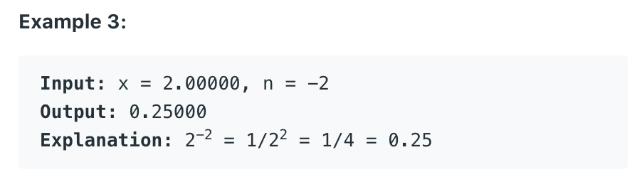
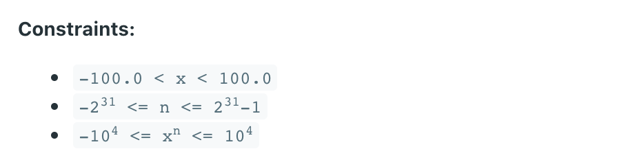

## 50. Pow(x, n)
- Implement pow(x, n), which calculates x raised to the power n (xn).

- Example 1:
  - Input: `2.00000`, `10`
  - Output: `1024.00000`

- Example 2:
  - Input: `2.10000`, `3`
  - Output: `9.26100`





```java
class Solution {
    public double myPow(double x, int n) {

        if (n < 0) {
            n = -n;
            x = 1/x;
        }
        
        return helperPow(x, n);
    }
    
    private double helperPow(double x, int n) {
        if (n == 0) {
            return 1.0;
        }
        
        double half = helperPow(x, n/2);
        return (n % 2 == 0) ? half * half : half * half * x;
    }
}
```

---


```java
class Solution {
    private double helpPow(double x, long N){
        if(N == 0){
            return 1.0;
        }
        double temp = helpPow(x, N/2);
        return (N % 2 == 0)? (temp * temp) : (temp * temp * x);
    }
    
    public double myPow(double x, int n) {
        //to avoid integer overflow, cast int to long
        long N = n;
        if(N < 0){
           x = 1 / x;   // if N is negative, x = 1/x 直接转换成倒数
           N = -N;      // convert N to be postive, since x already = 1/x
        }
        
        return helpPow(x, N);
        //we need to write a helper function , since myPow(double x, int n)
        //we can not assign Long to int   int n != Long N, 精度只有从低往高走！
    }
}
```