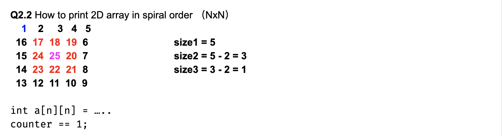

# Spiral Order Traverse I

```ruby
Traverse an N * N 2D array in spiral order clock-wise starting from the top left corner. 
Return the list of traversal sequence.

Assumptions

The 2D array is not null and has size of N * N where N >= 0


Examples

{ {1,  2,  3},

  {4,  5,  6},

  {7,  8,  9} }

the traversal sequence is [1, 2, 3, 6, 9, 8, 7, 4, 5]
```


---




```java
public class Solution {
  public List<Integer> spiral(int[][] matrix) {
    // Write your solution here
    List<Integer> list = new ArrayList<>();
    recursiveTraverse(matrix, 0, matrix.length, list);
    return list;
  }

  private void recursiveTraverse(int[][] matrix, int offset, int size,
   List<Integer> result){
     //base case:
     if(size == 0){
       return;
     }
     if(size == 1){
       result.add(matrix[offset][offset]);
       return;
     }
     for(int i=0; i<size-1; i++){
       result.add(matrix[offset][offset + i]);
     }
     for(int i=0; i<size-1; i++){
       result.add(matrix[offset+i][offset + size-1]);
     }

     for(int i=size-1; i >= 1; i--){
        result.add(matrix[offset+size-1][offset + i]);
     }
     for(int i=size-1; i >= 1; i--){
       result.add(matrix[offset+i][offset]);
     }

     recursiveTraverse(matrix, offset+1, size-2, result);
   }
}

```