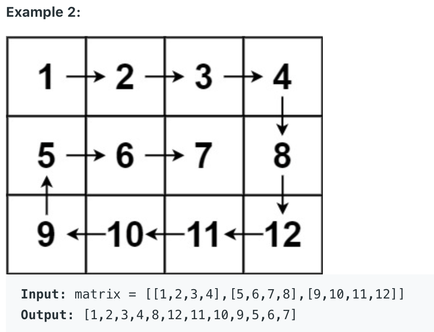
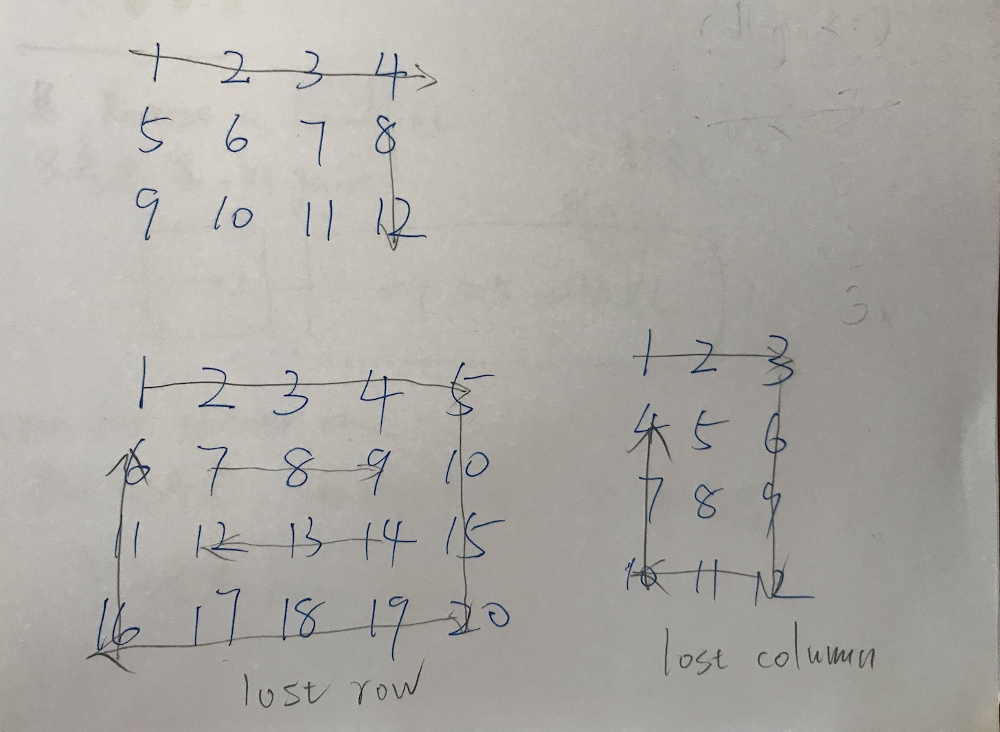
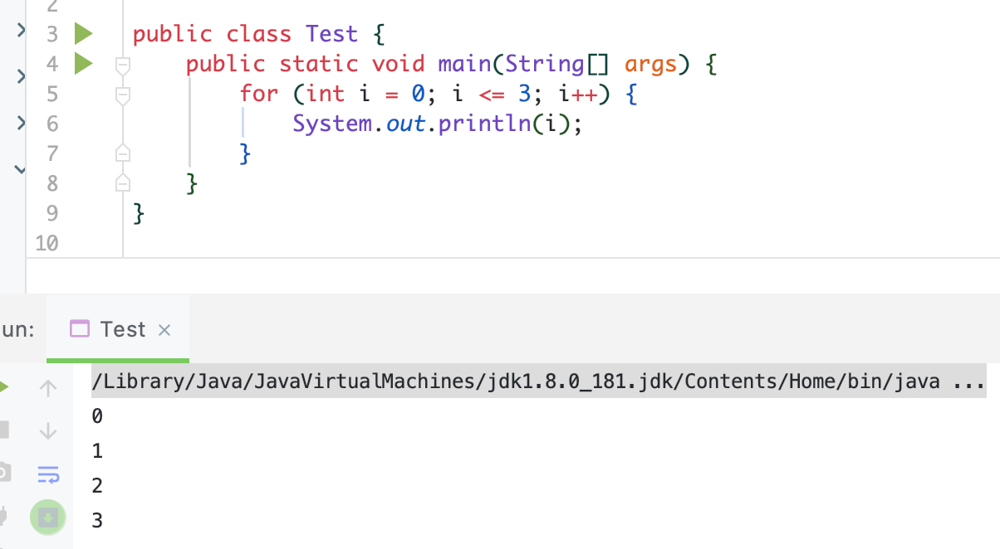
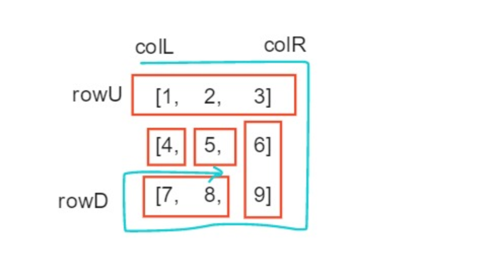

## 54. Spiral Matrix



## Analysis:




---

```java
public class Solution {
    public List<Integer> spiralOrder(int[][] matrix) {
        List<Integer> res = new ArrayList<Integer>();
        if (matrix.length == 0 || matrix[0].length == 0) return res;

        int top = 0;
        int bottom = matrix.length - 1;
        int left = 0;
        int right = matrix[0].length - 1;

        while (top <= bottom && left <= right) { // while true
            for (int i = left; i <= right; i++) {
                res.add(matrix[top][i]);
            }
            top++;
            if (left > right || top > bottom) {
                break;
            }


            for (int i = top; i <= bottom; i++) {
                res.add(matrix[i][right]);
            }
            right--;
            if (left > right || top > bottom) {
                break;
            }


            for (int i = right; i >= left; i--) {
                res.add(matrix[bottom][i]);
            }
            bottom--;
            if (left > right || top > bottom) {
                break;
            }


            for (int i = bottom; i >= top; i--) {
                res.add(matrix[i][left]);
            }
            left++;
            if (left > right || top > bottom) {
                break;
            }
        }

        return res;
    }   
}

```
---

#### Python

```py
class Solution:
    def spiralOrder(self, matrix: List[List[int]]) -> List[int]:
        res = []
        top, bottom = 0, len(matrix) - 1
        left, right = 0, len(matrix[0]) - 1

        while top <= bottom and left <= right:
            for i in range(left, right + 1):
                res.append(matrix[top][i])
            top += 1
            if left > right or top > bottom:
                break

            for i in range(top, bottom + 1):
                res.append(matrix[i][right])
            right -= 1
            if left > right or top > bottom:
                break

            for i in range(right, left - 1, -1):
                res.append(matrix[bottom][i])
            bottom -= 1
            if left > right or top > bottom:
                break

            for i in range(bottom, top - 1, -1):
                res.append(matrix[i][left])
            left += 1
            if left > right or top > bottom:
                break

        return res
```