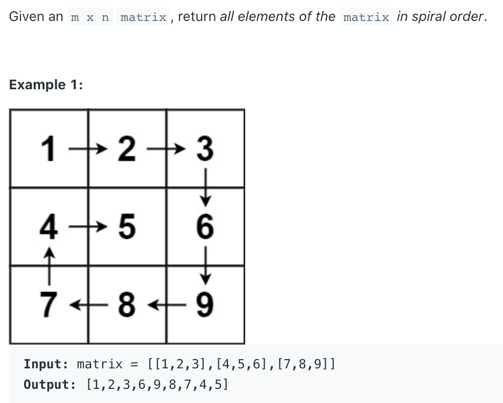

## 54. Spiral Matrix



## Analysis:

- [Approach 1: Set Up Boundaries](https://leetcode.com/problems/spiral-matrix/solutions/1408316/spiral-matrix/#:~:text=Approach%201%3A%20Set%20Up%20Boundaries)

---
```java
class Solution {
    public List<Integer> spiralOrder(int[][] matrix) {
        List<Integer> res = new ArrayList<>();
        if (matrix.length == 0 || matrix[0].length == 0) return res;

        int rows = matrix.length;
        int columns = matrix[0].length;
        int up = 0;
        int down = rows - 1;
        int left = 0;
        int right = columns - 1;

        while (res.size() < rows * columns) {
            // Traverse from left to right along the upper boundary
            for (int col = left; col <= right; col++) {
                res.add(matrix[up][col]);
            }

            // Traverse from top to bottom along the right boundary
            for (int row = up + 1; row <= down; row++) {
                res.add(matrix[row][right]);
            }

            // Check if the next layer is still valid
            if (up < down) {
                // Traverse from right to left along the bottom boundary
                for (int col = right - 1; col >= left; col--) {
                    res.add(matrix[down][col]);
                }
            }

            // Check if the next layer is still valid
            if (left < right) {
                // Traverse from bottom to top along the left boundary
                for (int row = down - 1; row > up; row--) {
                    res.add(matrix[row][left]);
                }
            }
            
            left++;
            right--;
            up++;
            down--;
        }
        return res;
    }
}
```


---

#### Python

```py
class Solution:
    def spiralOrder(self, matrix: List[List[int]]) -> List[int]:
        res = []
        top, bottom = 0, len(matrix) - 1
        left, right = 0, len(matrix[0]) - 1

        while top <= bottom and left <= right:
            for i in range(left, right + 1):
                res.append(matrix[top][i])
            top += 1
            if left > right or top > bottom:
                break

            for i in range(top, bottom + 1):
                res.append(matrix[i][right])
            right -= 1
            if left > right or top > bottom:
                break

            for i in range(right, left - 1, -1):
                res.append(matrix[bottom][i])
            bottom -= 1
            if left > right or top > bottom:
                break

            for i in range(bottom, top - 1, -1):
                res.append(matrix[i][left])
            left += 1
            if left > right or top > bottom:
                break

        return res
```