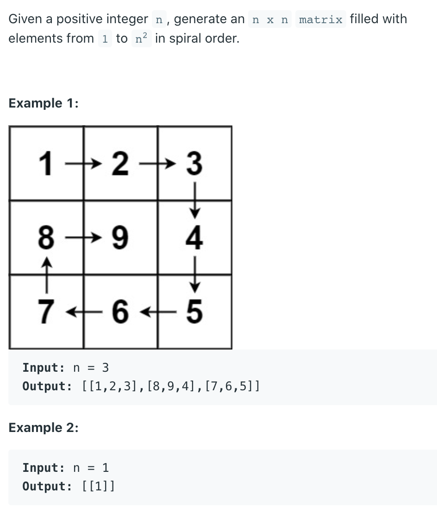
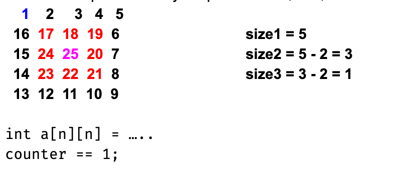

## 59. Spiral Matrix II





- corner case: if (size <= 1)
  - 必须处理当 size == 0 || size == 1 的时候
  - 这是因为当 n = 6 的时候， 6 - 2 - 2 - 2 = 0
    因为每一次减少: `size - 2`

- 我们也需要一个offset, 每一次递归可以发现 `offset - 1`

```java
class Solution {
    public int[][] generateMatrix(int n) {
        int[][] matrix = new int[n][n];

        recursive(matrix, 0, n, 1);
        return matrix;
    }

    private void recursive(int[][] res, int offset, int size, int counter) {
        if (size == 0) {
            return;
        }
        if (size == 1) {
            res[offset][offset] = counter;
            return;
        }
        for (int i = 0; i < size - 1; i++) {
            res[offset][offset + i] = counter;
            counter++;
        }
        for (int i = 0; i < size - 1; i++) {
            res[offset + i][offset + size - 1] = counter;
            counter++;
        }
        for (int i = size - 1; i >= 1; i--) {
            res[offset + size - 1][offset + i] = counter;
            counter++;
        }
        for (int i = size - 1; i >= 1; i--) {
            res[offset + i][offset] = counter;
            counter++;
        }

        recursive(res, offset + 1, size - 2, counter);
    }
}
```