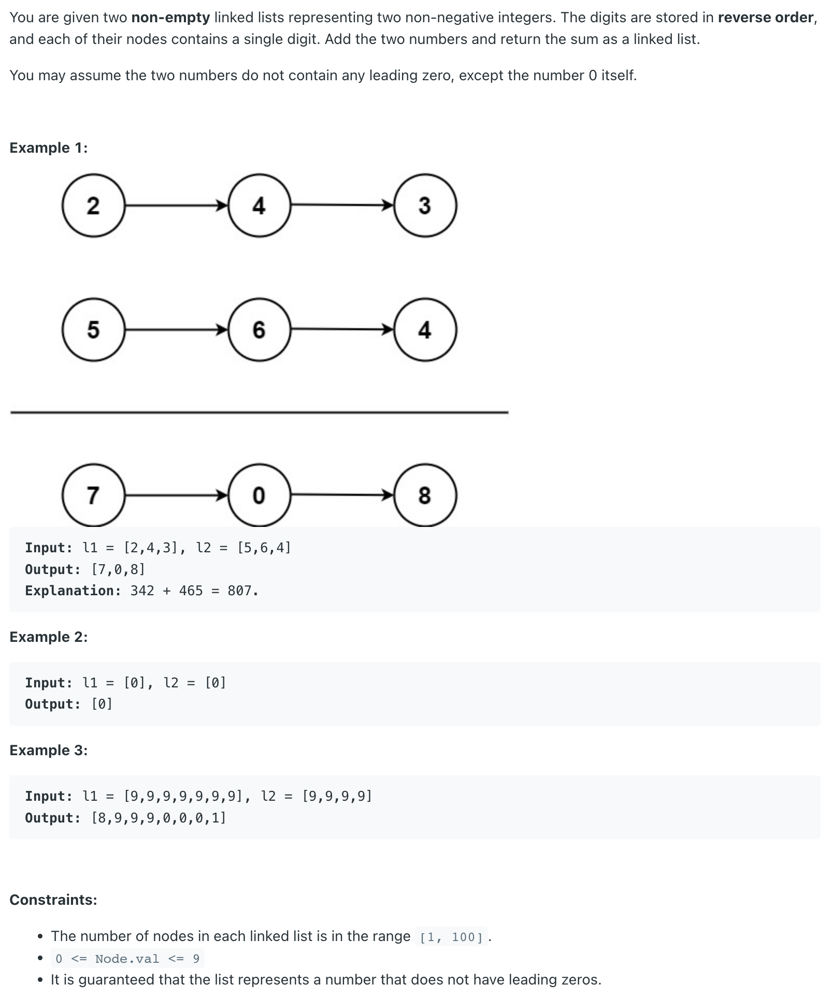

## 2. Add Two Numbers


### Analysis:


- Complexity Analysis

- Time complexity : `O(max(m, n))`
- Assume that m and n represents the length of l1 and l2 respectively, 
  the algorithm above iterates at most `max(m, n)` times.

- Space complexity : `O(max(m, n))`. 
  The length of the new list is at most `max(m,n) + 1`


- code

```java
/**
 * Definition for singly-linked list.
 * public class ListNode {
 *     int val;
 *     ListNode next;
 *     ListNode() {}
 *     ListNode(int val) { this.val = val; }
 *     ListNode(int val, ListNode next) { this.val = val; this.next = next; }
 * }
 */
class Solution {
    public ListNode addTwoNumbers(ListNode l1, ListNode l2) {
        ListNode dummy = new ListNode(0);
        ListNode cur = dummy;
        int count = 0;
        //if the last digit is more than 9, for example: 10
        // we need to handle this, and loop one more time
        while (l1 != null || l2 != null || count != 0) {
            if (l1 != null) {
                count += l1.val;
                l1 = l1.next;
            }
            
            if (l2 != null) {
                count += l2.val;
                l2 = l2.next;
            }
            cur.next = new ListNode(count % 10);
            count = count / 10;
            cur = cur.next;
        }
        return dummy.next;
    }
}
```