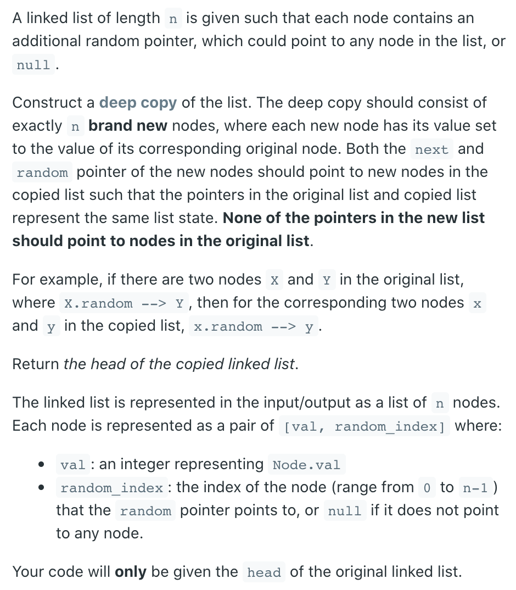
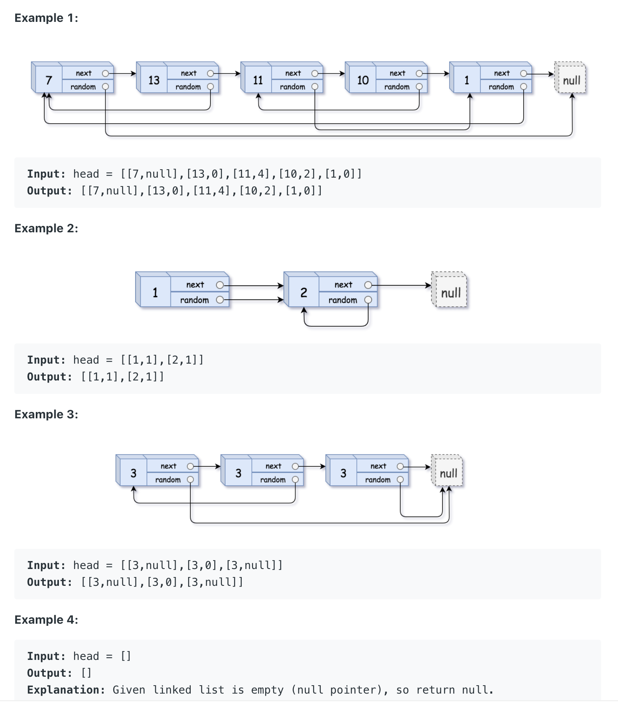
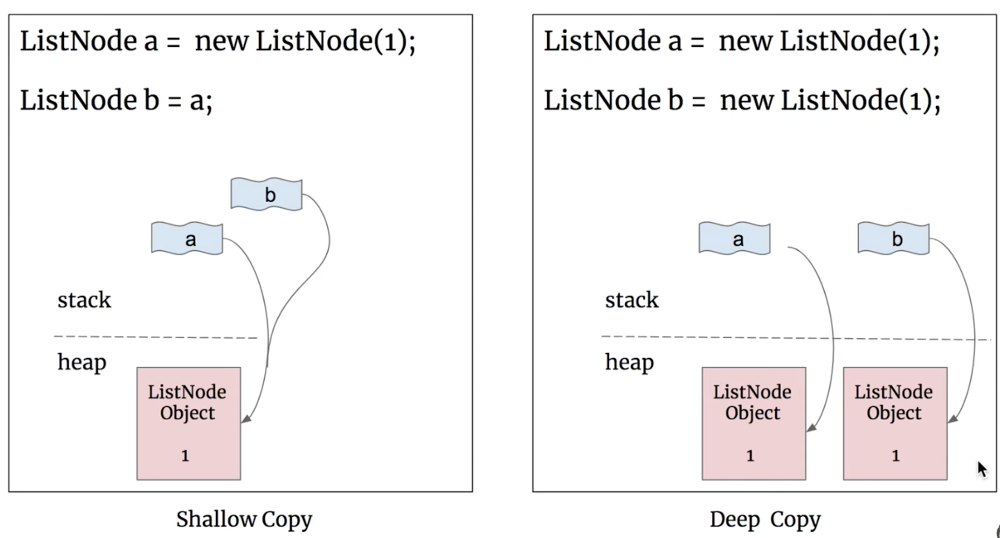

## 138. Copy List with Random Pointer | Deep Copy




- Deep copy:




- Assumptions:
  - if head is null, return null, 

- Approach:
  - Deep Copy:
    - deep copy is expensive and dereference, 简单说就是 copy 出一份新的,放在新的容器里
    - so we need to create a HashMap:
    - firstly, copy current Node
      - `HashMap<key = original Node, value = copied Node>` for example:
      - `<N1, N1'>`
      - `<N2, N2'>`
      - `<N3, N3'>`
    - secondly, copy current Node's random Node
      - `<N1.random, N1.random'>`
      - `<N2.random, N2.random'>`
      - `<N3.random, N3.random'>`


```java
/*
// Definition for a Node.
class Node {
    int val;
    Node next;
    Node random;

    public Node(int val) {
        this.val = val;
        this.next = null;
        this.random = null;
    }
}
*/

class Solution {
    public Node copyRandomList(Node head) {
        if(head == null){
            return null;
        }
        Node dummy = new Node(0);
        Node cur = dummy;
        Map<Node, Node> map = new HashMap<>();
        while(head != null){
            //fist, copy Node
            if(head != null){
                if(!map.containsKey(head)){
                    map.put(head, new Node(head.val));
                }
                cur.next = map.get(head);
            }
            //second, copy Node.random 
            if(head.random != null){
                if(!map.containsKey(head.random)){
                    map.put(head.random, new Node(head.random.val));
                }
                cur.next.random = map.get(head.random);
            }
            head = head.next;
            cur = cur.next;
        }
        return dummy.next;
    }
}
```

---

### Method 2

```java
class Solution {
    public Node copyRandomList(Node head) {
        if (head == null) {
            return head;
        }
        Map<Node, Node> map = new HashMap<>();
        Node cur = head;
        while (cur != null) {
            map.put(cur, new Node(cur.val));
            cur = cur.next;
        }
        
        cur = head;
        while (cur != null) {
            map.get(cur).next = map.get(cur.next);
            map.get(cur).random = map.get(cur.random);
            cur = cur.next;
        }
        return map.get(head);
    }
}
```