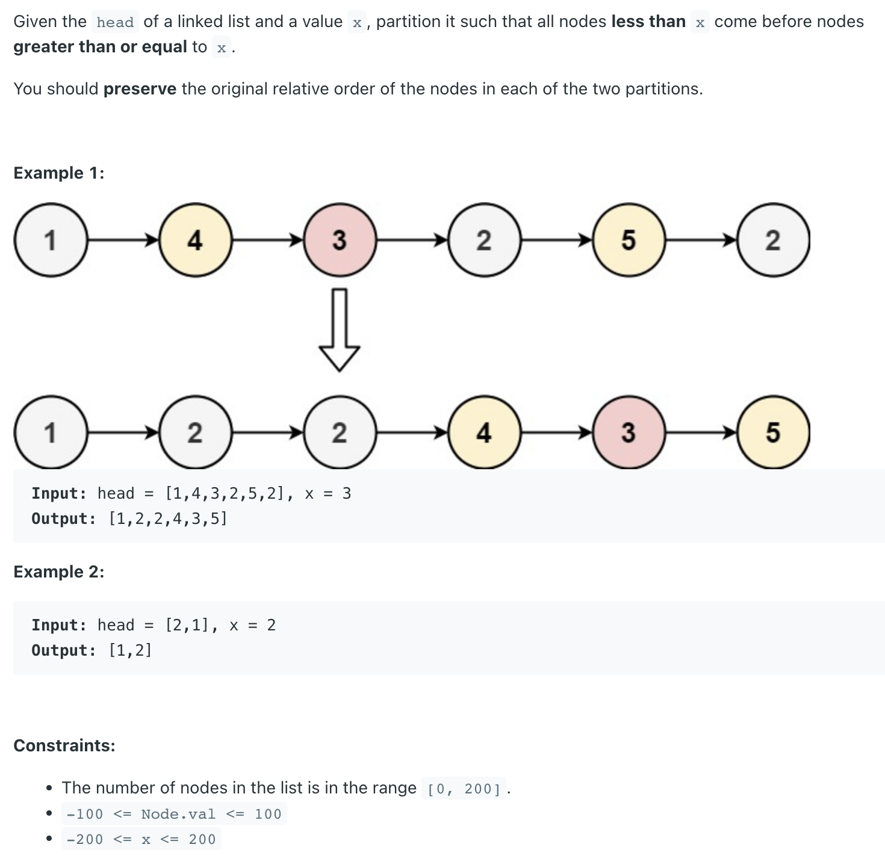

## 86. Partition List

---

input: 1 -> 6 -> 3 -> 2a -> 5 -> 2b | target x=4
result: 1 -> 3 -> 2a -> 2b -> 6 -> 5

- step 1: allocate two new linkedlist heads (one for small values, one for large values)

dummySmallHead ->
dummyLargeHead -> 

- step 2: Iterate over every single element in the list, and compare with the current node's
  value with the target's value
  - case 1: if cur.value < target'value: Add the current node to the tail of the first
    linkedlist
  - case 2: otherwise, Add the current node to the tail of the second linkedlist.

dummySmallHead -> 1 -> 3 -> 2a -> 2b
dummyLargeHead -> 6 -> 5

- step 3: concatenate the tail of the first half to the head of the 2nd linked list

smallTail.next = dummyLargeHead.next
dummySamllHead -> 1 -> 3 -> 2a -> 2b -> 6 -> 5

- step 4: The tail of the large `list.next = null`

---

```java
/**
 * Definition for singly-linked list.
 * public class ListNode {
 *     int val;
 *     ListNode next;
 *     ListNode() {}
 *     ListNode(int val) { this.val = val; }
 *     ListNode(int val, ListNode next) { this.val = val; this.next = next; }
 * }
 */
class Solution {
    public ListNode partition(ListNode head, int x) {
        if (head == null || head.next == null) {
            return head;
        }
        
        ListNode small = new ListNode(0);
        ListNode large = new ListNode(0);
        ListNode curSmall = small;
        ListNode curLarge = large;
        while (head != null) {
            if (head.val< x) {
                curSmall.next = head;
                curSmall = curSmall.next;
            } else {
                curLarge.next = head;
                curLarge = curLarge.next;
            }
            head = head.next;
        }
        curLarge.next = null;
        curSmall.next = large.next;
        return small.next;
    }
}
```