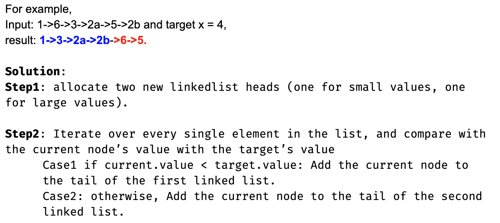
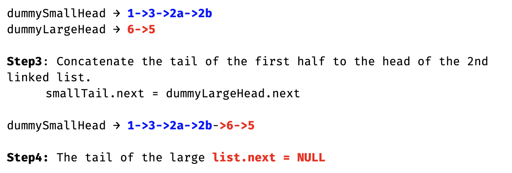

## 86. Partition List

---

- 本题相对位置不能变，所以比给定数值小的node 按照原定顺序放左边，否则放右边



---

```java
/**
 * Definition for singly-linked list.
 * public class ListNode {
 *     int val;
 *     ListNode next;
 *     ListNode() {}
 *     ListNode(int val) { this.val = val; }
 *     ListNode(int val, ListNode next) { this.val = val; this.next = next; }
 * }
 */
class Solution {
    public ListNode partition(ListNode head, int x) {
        if (head == null || head.next == null) {
            return head;
        }
        
        ListNode small = new ListNode(9527);
        ListNode large = new ListNode(0);
        ListNode curSmall = small;
        ListNode curLarge = large;
        while (head != null) {
            if (head.val < x) {
                curSmall.next = head;
                curSmall = curSmall.next;
            } else {
                curLarge.next = head;
                curLarge = curLarge.next;
            }
            head = head.next;
        }
        curLarge.next = null;
        curSmall.next = large.next;
        return small.next;
    }
}
```