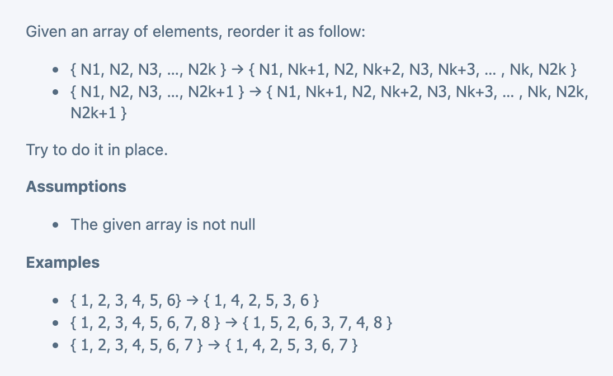
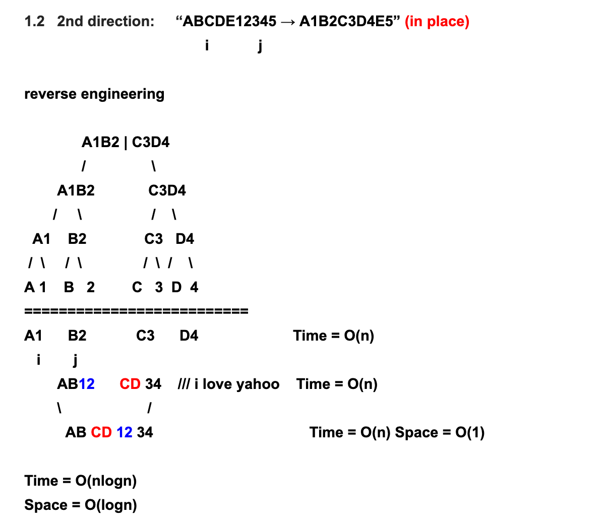
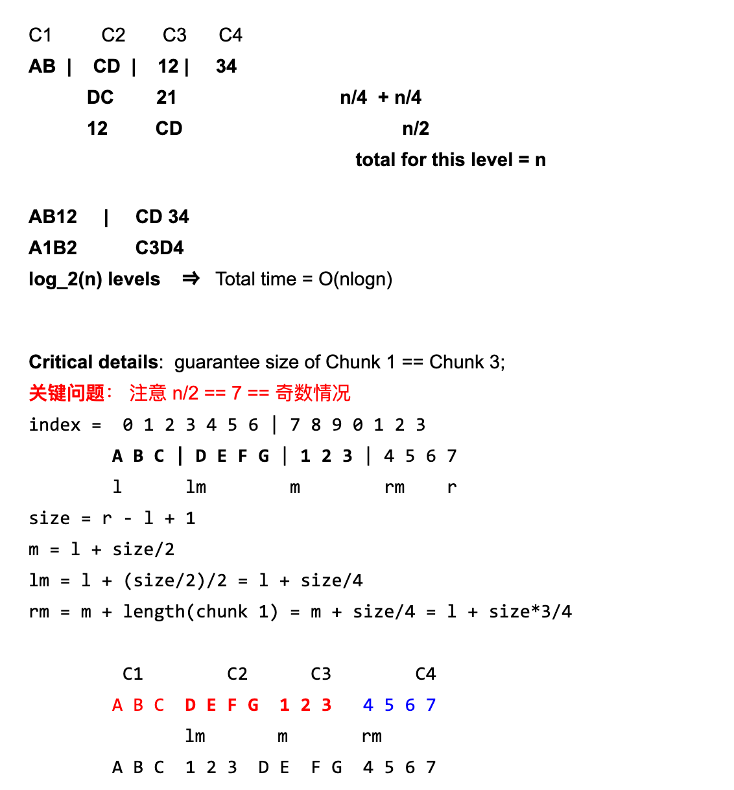

## ReOrder Array







```java
public class Solution {
  public int[] reorder(int[] array) {
    if (array.length % 2 == 0) {
      recursive(array, 0, array.length - 1);
    } else {
      recursive(array, 0, array.length - 2);
    }
    return array;
  }

  private void recursive(int[] arr, int left, int right) {
    if (right - left <= 1) { //size <= 2
      return;
    }
    int size = right - left + 1;
    int mid = left + size / 2;
    int lm = left + size / 4;
    int rm = left + size * 3 / 4;
    reverse(arr, lm, mid - 1);
    reverse(arr, mid, rm - 1);
    reverse(arr, lm, rm - 1);

    recursive(arr, left,  left + (lm - left) * 2 - 1);
    recursive(arr, left + (lm - left) * 2, right);
  }

  private void reverse(int[]arr, int left, int right) {
    while (left < right) {
      int temp = arr[left];
      arr[left] = arr[right];
      arr[right] = temp;
      left++;
      right--;
    }
  }
}
```