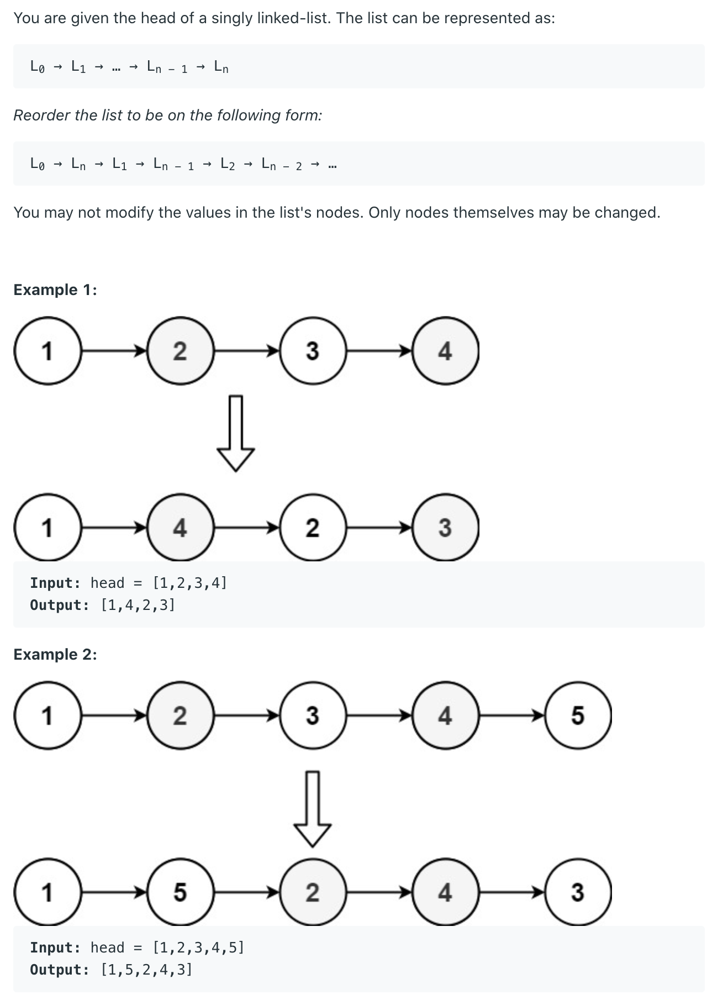

## 143. Reorder List


---

solution:
- `N1 -> N2 -> N3 -> N4 -> N5 -> N6 -> Null` (convert to)
  `(N1 -> Nn) -> (N2 -> Nn-1) ...`

- Step 1: Find the middle node of the linkedList
  and split it into two halves

- Step 2: Reverse the 2nd half:
  `N6 -> N5 -> N4`

- Step 3: merge: 
  `dummy -> N1 -> N6 -> N2 -> N5 -> N3 -> N4 -> Null`

---

```java
/**
 * Definition for singly-linked list.
 * public class ListNode {
 *     int val;
 *     ListNode next;
 *     ListNode() {}
 *     ListNode(int val) { this.val = val; }
 *     ListNode(int val, ListNode next) { this.val = val; this.next = next; }
 * }
 */
class Solution {
    public void reorderList(ListNode head) {
        if (head == null || head.next == null) {
            return;
        }
        
        ListNode midNode = findMiddleNode(head);
        ListNode secondHead = midNode.next;
        midNode.next = null;
        
        ListNode reversedSecond = reverse(secondHead);
        ListNode mergedList = merge(head, reversedSecond);
        head = mergedList;
    }

    private ListNode findMiddleNode(ListNode tmpHead) {
        ListNode slow = tmpHead;
        ListNode fast = tmpHead;
        while (fast.next != null && fast.next.next != null) {
            slow = slow.next;
            fast = fast.next.next;
        }
        return slow;
    }

    private ListNode reverse(ListNode dummy) {
        ListNode prev = null;
        ListNode cur = dummy;
        ListNode next = null;
        while (cur != null) {
            next = cur.next;
            cur.next = prev;
            prev = cur;
            cur = next;
        }
        return prev;
    }    

    /*
                 N1 -> N2 -> N3 -> N4 -> N5 -> N6
        
                 N1 -> N2 -> N3    N6 -> N5 -> N4
                     
        dummy -> N1 -> N6 -> N2 -> N5 -> N3 -> N4 -> Null    
    */
    private ListNode merge(ListNode one, ListNode two) {
        ListNode dummy = new ListNode(0);
        ListNode cur = dummy;
        while (one != null && two != null) {
            cur.next = one;
            one = one.next;
            cur.next.next = two;
            two = two.next;
            cur = cur.next.next;
        }
        if (one != null) {
            cur.next = one;
        } else {
            cur.next = two;
        }
        return dummy.next;
    }
}
```