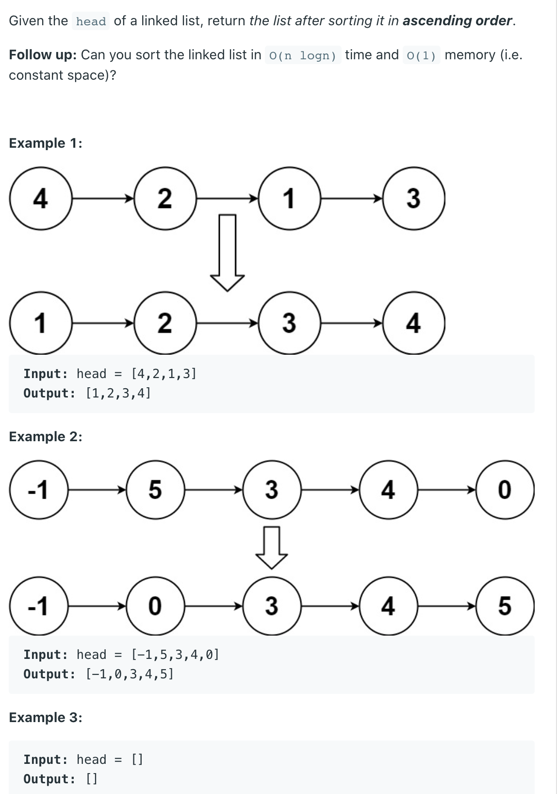

## 148. Sort List



```java
/**
 * Definition for singly-linked list.
 * public class ListNode {
 *     int val;
 *     ListNode next;
 *     ListNode() {}
 *     ListNode(int val) { this.val = val; }
 *     ListNode(int val, ListNode next) { this.val = val; this.next = next; }
 * }
 */
class Solution {
    public ListNode sortList(ListNode head) {
        if (head == null || head.next == null) {
            return head;
        }
        ListNode midNode = findMid(head);
        ListNode midNext = midNode.next;
        midNode.next = null;
        ListNode left = sortList(head);
        ListNode right = sortList(midNext);
        return merge(left, right);
    }
    
    private ListNode findMid(ListNode head) {
        ListNode slow = head;
        ListNode fast = head;
        while (fast.next != null && fast.next.next != null) {
            slow = slow.next;
            fast = fast.next.next;
        }
        return slow;
    }
    
    private ListNode merge(ListNode one, ListNode two) {
        ListNode dummy = new ListNode(0);
        ListNode cur = dummy;
        while (one != null && two != null) {
            if (one.val <= two.val) {
                cur.next = one;
                one = one.next;
                cur = cur.next;
            } else {
                cur.next = two;
                two = two.next;
                cur = cur.next;
            }
            
            if (one != null) {
                cur.next = one;
            }
            if (two != null) {
                cur.next = two;
            }
            
        }
        return dummy.next;
    }
}
```