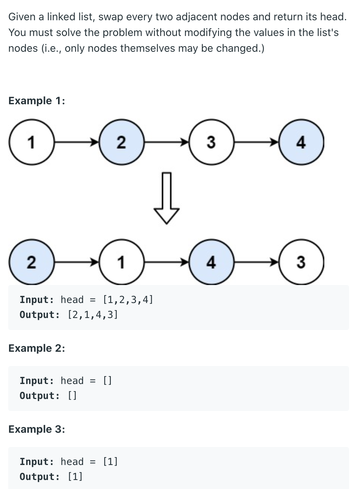
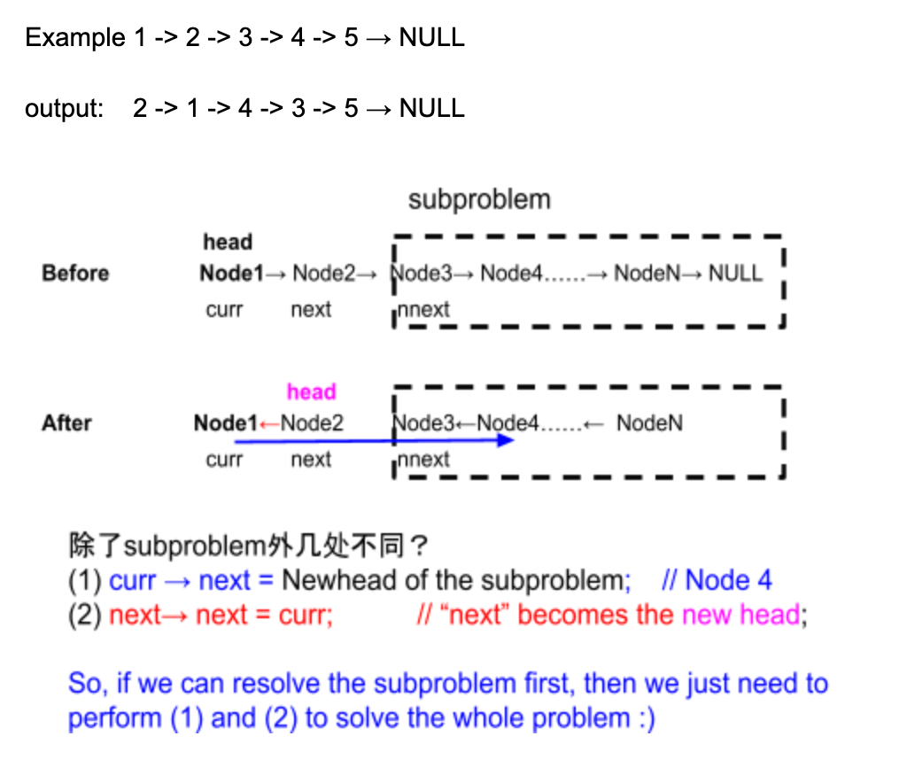

## 24. Swap Nodes in Pairs





```java
/*
   1 -> 2 -> 3 -> 4 -> 5 -> null
   cur next
   
   2 -> 1 -> {3 -> 4 -> 5} 
   {3 -> 4 -> 5} is subproblem
   
   2 -> 1 -> {3 -> 4 -> 5} 
 next-> cur
 
  cur -> {3 -> 4 -> 5}
*/

/**
 * Definition for singly-linked list.
 * public class ListNode {
 *     int val;
 *     ListNode next;
 *     ListNode() {}
 *     ListNode(int val) { this.val = val; }
 *     ListNode(int val, ListNode next) { 
            this.val = val; this.next = next; 
       }
 * }
 */
class Solution {
    public ListNode swapPairs(ListNode head) {
        if (head == null || head.next == null) {
            return head;
        }
        
        ListNode next = head.next;
        ListNode newHead = swapPairs(next.next);
        head.next = newHead;
        next.next = head;
        return next;
    }
}
```