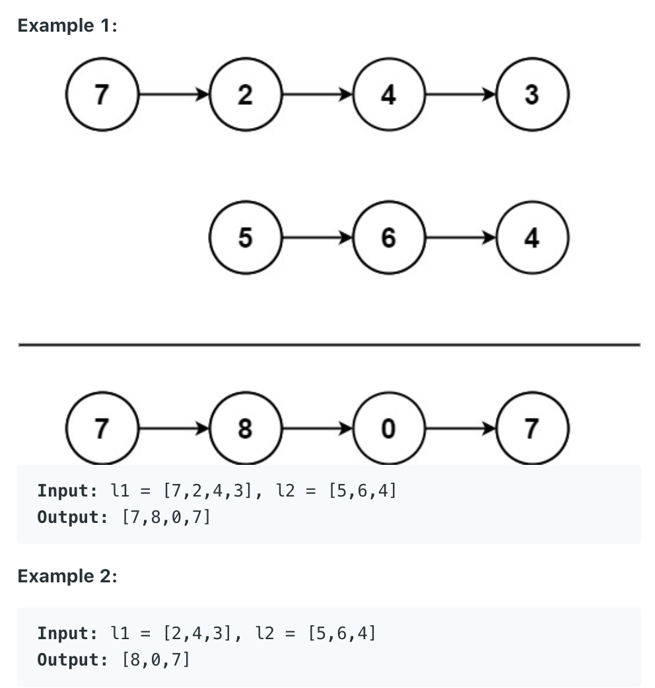

## 445. Add Two Numbers II

- You are given two `non-empty` linked lists representing two non-negative integers. 
  The most significant digit comes first and each of their nodes contains a single digit. 
  Add the two numbers and return the sum as a linked list.

- You may assume the two numbers do not contain any leading zero, except the number 0 itself.



---

```java
/**
 * Definition for singly-linked list.
 * public class ListNode {
 *     int val;
 *     ListNode next;
 *     ListNode() {}
 *     ListNode(int val) { this.val = val; }
 *     ListNode(int val, ListNode next) { this.val = val; this.next = next; }
 * }
 */
class Solution {
    public ListNode addTwoNumbers(ListNode l1, ListNode l2) {
        ListNode dummy = new ListNode(0);
        ListNode cur = dummy;
        
        ListNode reverseL1 = reverse(l1); 
        ListNode reverseL2 = reverse(l2); 
        int count = 0;
        while (reverseL1 != null || reverseL2 != null || count != 0) {
            if (reverseL1 != null) {
                count += reverseL1.val;
                reverseL1 = reverseL1.next;
            }
            
            if (reverseL2 != null) {
                count += reverseL2.val;
                reverseL2 = reverseL2.next;
            }
            cur.next = new ListNode(count % 10);
            count = count / 10;
            cur = cur.next;
        }
        return reverse(dummy.next);
    }
    
    private ListNode reverse(ListNode head) {
        ListNode prev = null;
        ListNode cur = head;
        ListNode next = null;
        while (cur != null) {
            next = cur.next;
            cur.next = prev;
            prev = cur;
            cur = next;
        }
        return prev;
    }
}
```

