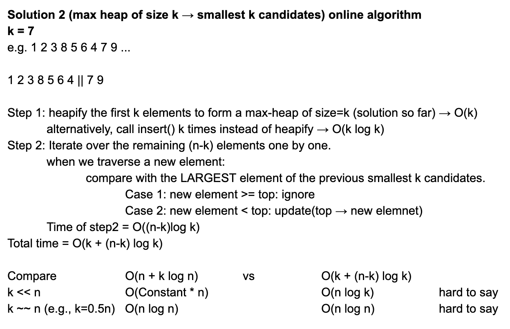
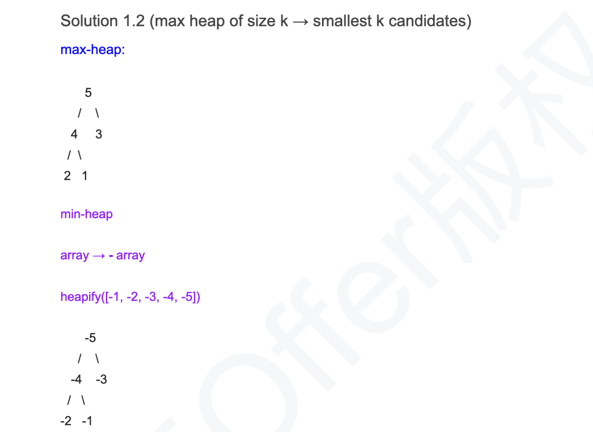
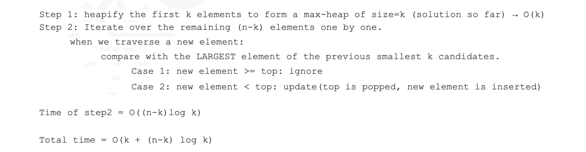
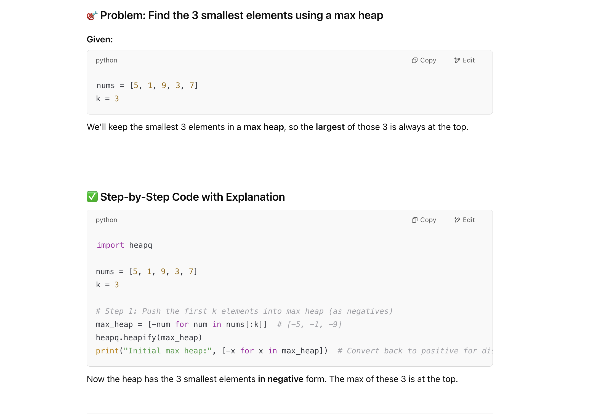
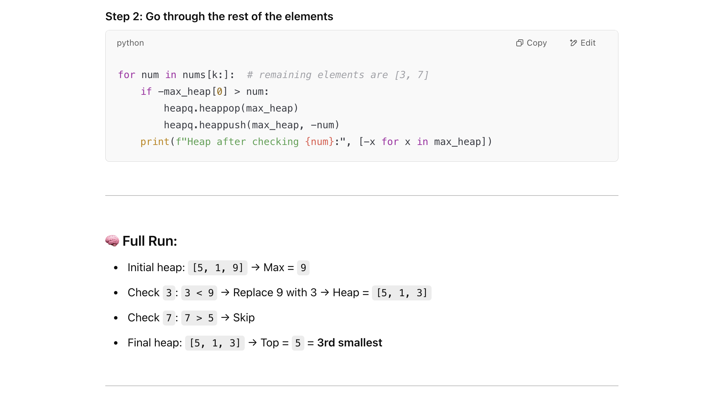

## K Smallest In Unsorted Array

- 这是215. Kth Largest Element in an Array 的一个变种题目：


- Find the K smallest numbers in an unsorted integer array A. 
  The returned numbers should be in ascending order.

Assumptions
A is not null
K is >= 0 and smaller than or equal to size of A

Return

- an array with size K containing the K smallest numbers in ascending order
- Examples
- A = {3, 4, 1, 2, 5}, K = 3, the 3 smallest numbers are {1, 2, 3}

---

- Solution 0 sort -> O(N * logN)

- Solution 1 (min heap)
  - Step1: heapify all elements -> O(n)
  - Step2: call pop() k times to get the k smallest elements. -> O(k logN)
  - Time = O(N + k longN)





---

```java
public class Solution {
      //Method 1: K sized max heap
  public int[] kSmallest(int[] array, int k) {
    // Write your solution here
    //handle all possible corner cases at the very beginning
    if(array.length == 0 || k == 0){
      return new int[0];
    }
    PriorityQueue<Integer> maxHeap = new PriorityQueue<Integer>(k, 
    new Comparator<Integer>(){
      @Override
      public int compare(Integer o1, Integer o2){
        //do not use "==" here !!
        if(o1.equals(o2)){
          return 0;
        }
        return o1 > o2 ? -1 : 1;
      }
    });
    for(int i=0; i<array.length; i++){
      if(i < k){
        //offer the first k elements into max heap
        maxHeap.offer(array[i]);
      }else if(array[i] < maxHeap.peek()){
        maxHeap.poll();
        maxHeap.offer(array[i]);
      }
    }
    int[] result = new int[k];
    for(int i = k-1 ; i >= 0; i--){
      result[i] = maxHeap.poll();
    }
    return result;
  }
}
```
---








```py
class Solution:
    def kSmallest(self, nums: List[int], k: int) -> int:
        if not nums or k <= 0 or k > len(nums):
            return -1

        # Max heap to store kth smallest elements (we invert to use Python's min-heap)
        res = [-elem for elem in nums[0:k]]
        heapq.heapify(res)
        for i in range(k, len(nums)):
            if -res[0] > nums[i]:  # if current element is smaller than largest in heap
                heapq.heappop(res)
                heapq.heappush(res, -nums[i])
        # Top of the max heap is the kth smallest (in negative)
        return -res[0]
```