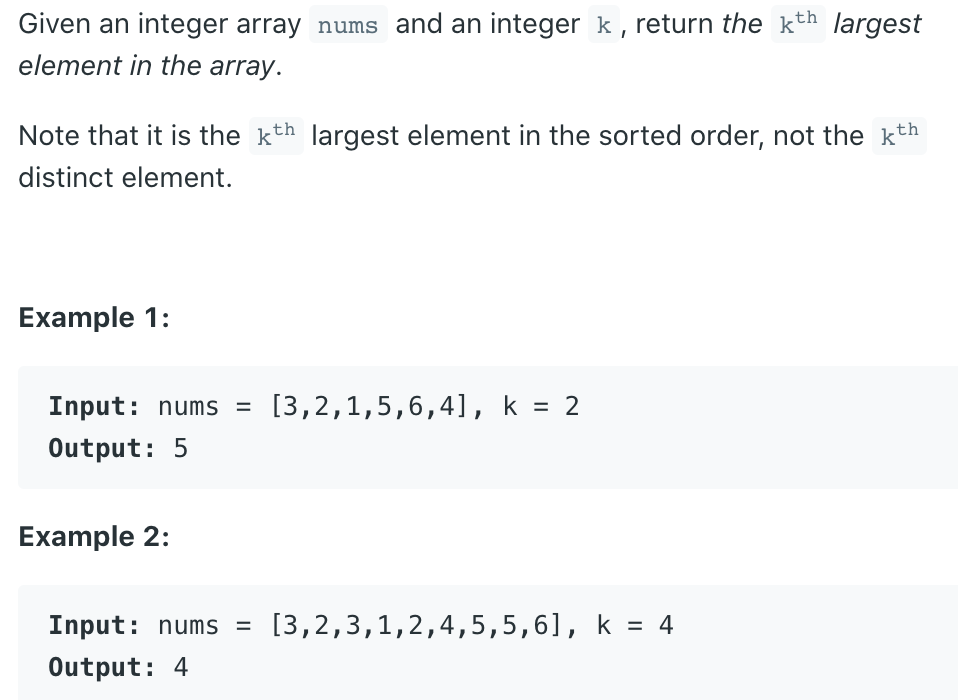

## 215. Kth Largest Element in an Array


- `O(N lg N)` running time + `O(1)` memory

```java
class Solution {
    public int findKthLargest(int[] nums, int k) {
        if (nums.length == 0 || k == 0) {
            return new int[0];
        }
        int n = nums.length;
        Arrays.sort(nums);
        return nums[n - k];
    }
}
```

---

- `O(N lg K)` running time + `O(K)` memory

```java
class Solution {
    public int findKthLargest(int[] nums, int k) {
        if (nums.length == 0 || k == 0) {
            return new int[0];
        }        
        PriorityQueue<Integer> maxHeap = new PriorityQueue<>(k, new Comparator<Integer>() {
            @Override
            public int compare(Integer o1, Integer o2) {
                if (o1.equals(o2)) {
                    return 0;
                }
                
                return o1 > o2 ? -1 : 1;
            }
        });
        
        for (int num : nums) {
            maxHeap.offer(num);
        }
        
        int res = 0;
        for (int i = 0; i < k; i++) {
            res = maxHeap.poll();
        }
        
        return res;
    }
}
```


---

- `O(N lg K)` running time + `O(K)` memory, **online algorithm**

- [video c6 - 39.50]()

```java
class _215_KthLargestElementInArray {
    public int findKthLargest(int[] nums, int k) {
        PriorityQueue<Integer> minHeap = new PriorityQueue<>(
                (a, b) -> (a - b)
        );

        for (int num : nums) {
            minHeap.offer(num);

            if (minHeap.size() > k) {
                minHeap.poll();
            }
        }
        return minHeap.peek();
    }

    public static void main(String[] args) {
        _215_KthLargestElementInArray kthLargestElementInArray = new _215_KthLargestElementInArray();
        int[] nums = {3, 2, 3, 1, 2, 4, 5, 5, 6};
        int res = kthLargestElementInArray.findKthLargest(nums, 4);
        System.out.println(res); // 4
    }
}
```