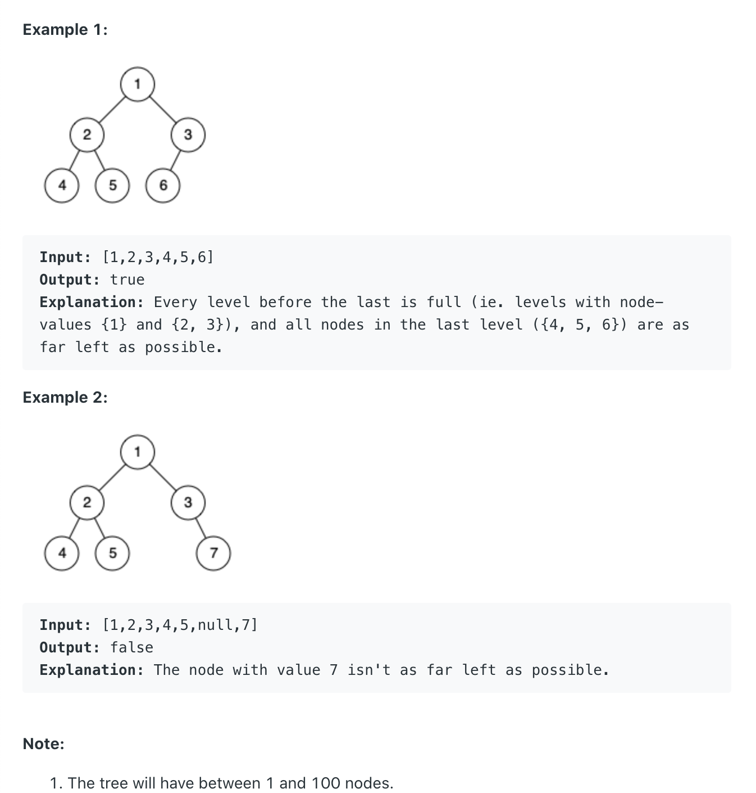

# 958. Check Completeness of a Binary Tree | BFS

```ruby
Given a binary tree, determine if it is a complete binary tree.

Definition of a complete binary tree from Wikipedia:
In a complete binary tree every level, except possibly the last, is completely filled, 
and all nodes in the last level are as far left as possible. 
It can have between 1 and 2h nodes inclusive at the last level h.
```



---


## Analysis:

- 使用BFS 来解决此题 => 第一时间 初始化 队列
- set flag = flase => 假如 遇到left node为null, 那么 right child 也必须为null, 否则 => incomplete
- if left == right == null , 则说明 => complete
- if left != null, right == null , 则继续向下一层探索


```java
/**
 * Definition for a binary tree node.
 * public class TreeNode {
 *     int val;
 *     TreeNode left;
 *     TreeNode right;
 *     TreeNode() {}
 *     TreeNode(int val) { this.val = val; }
 *     TreeNode(int val, TreeNode left, TreeNode right) {
 *         this.val = val;
 *         this.left = left;
 *         this.right = right;
 *     }
 * }
 */
class Solution {
    public boolean isCompleteTree(TreeNode root) {
        if(root == null){
            return true;
        }
        Queue<TreeNode> queue = new LinkedList<>(); //本题使用BFS 广度优先
        queue.offer(root);
        boolean flag = false; //初始化 flag
        while(!queue.isEmpty()){ //假设我们的队列不用空
            TreeNode cur = queue.poll(); //每次一次更新当前节点，先左child, 然后右child
            if(cur == null){ //if left child is null, => set flag = true, 
            //这种请款下,right child 必须为null, 否则incomplete
                flag = true;
            }else{
                //else => 则表示， left child is not null
                if(flag){
                    flag = false;
                    return false;
                }
                queue.offer(cur.left);
                queue.offer(cur.right);
            }
        }
        return true;
    }
}
```