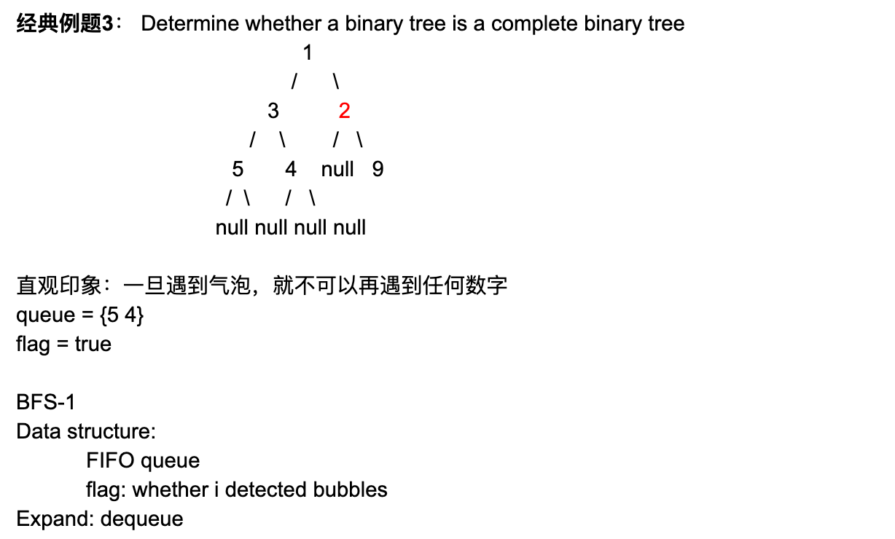

## 958. Check Completeness of a Binary Tree | BFS


- Given a binary tree, determine if it is a complete binary tree.

- Definition of a complete binary tree from Wikipedia:
  In a complete binary tree every level, except possibly the last, is completely filled, 
  and all nodes in the last level are as far left as possible. 
  It can have between 1 and 2h nodes inclusive at the last level h.


---


## Analysis:




- 使用BFS 来解决此题 => 第一时间 初始化 队列
- set flag = flase => 假如 遇到left node为null, 那么 right child 也必须为null, 否则 => incomplete
- if left == right == null , 则说明 => complete
- if left != null, right == null , 则继续向下一层探索


```java
/**
 * public class TreeNode {
 *   public int key;
 *   public TreeNode left;
 *   public TreeNode right;
 *   public TreeNode(int key) {
 *     this.key = key;
 *   }
 * }
 */
public class Solution {
  public boolean isCompleted(TreeNode root) {
    //本题使用BFS 广度优先
    if(root == null){
      return true;
    }
    Queue<TreeNode> queue = new LinkedList<TreeNode>();
    queue.offer(root);
    boolean flag = false;
    while(!queue.isEmpty()){
      TreeNode cur = queue.poll();
      if(cur == null){
        //if cur node is null, => set flag on
        flag = true;
      }

      if (cur != null) {
        //if cur node is not null  
        if (flag) {
          //if flag == true, that means in its history,
          //there is bubble(null) in binary tree
          return false;
        }
        queue.offer(cur.left);
        queue.offer(cur.right);
      }
    }
    return true;
  }
}
```

---

- 2nd way:

```java
/**
 * public class TreeNode {
 *   public int key;
 *   public TreeNode left;
 *   public TreeNode right;
 *   public TreeNode(int key) {
 *     this.key = key;
 *   }
 * }
 */
public class Solution {
  public boolean isCompleted(TreeNode root) {
    // Write your solution here
    if(root == null){
      return true;
    }
    Queue<TreeNode> queue = new LinkedList<TreeNode>();
    //if the flag is set true, there should not be any
    //child nodes afterwards.
    queue.offer(root);
    boolean flag = false;
    while(!queue.isEmpty()){
      TreeNode cur = queue.poll();
      //if any of the child is not present, set the
      //flag to be true
      if(cur.left == null){
        flag = true;
      }
      if (flag && cur.left != null) {
        //if flag is set but we still see cur has a 
        //left child, it is not completed tree
        return false;
      }
      if (flag == false && cur.left != null) {
        //if flag is not set and left child is present
        queue.offer(cur.left);
      }

      //same logic applied to the right child
      if (cur.right == null) {
        flag = true;
      }
      if (flag && cur.right != null) {
        return false;
      }
      if (flag == false && cur.right != null) {
        queue.offer(cur.right);
      }
    }
    return true;
  }
}
```