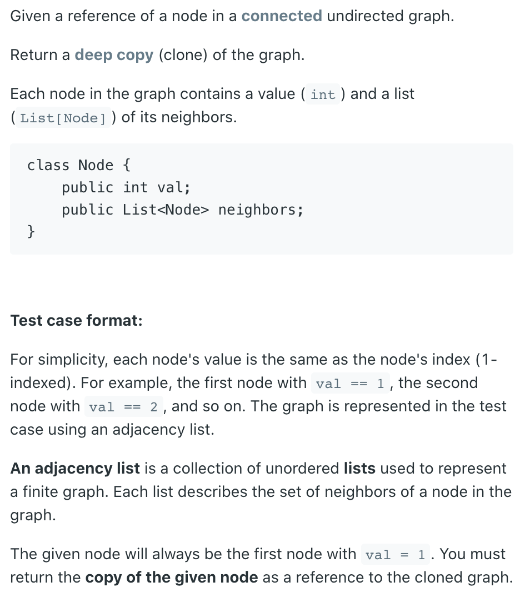
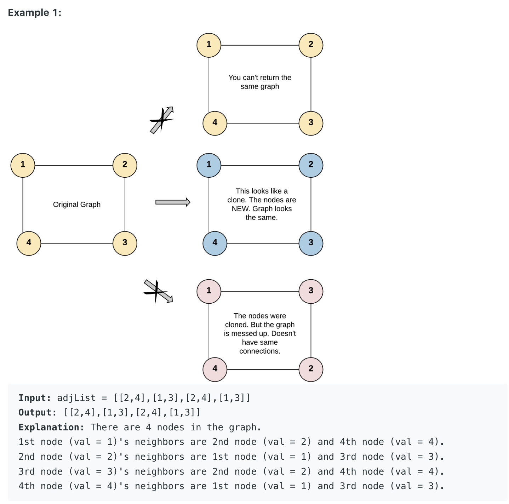
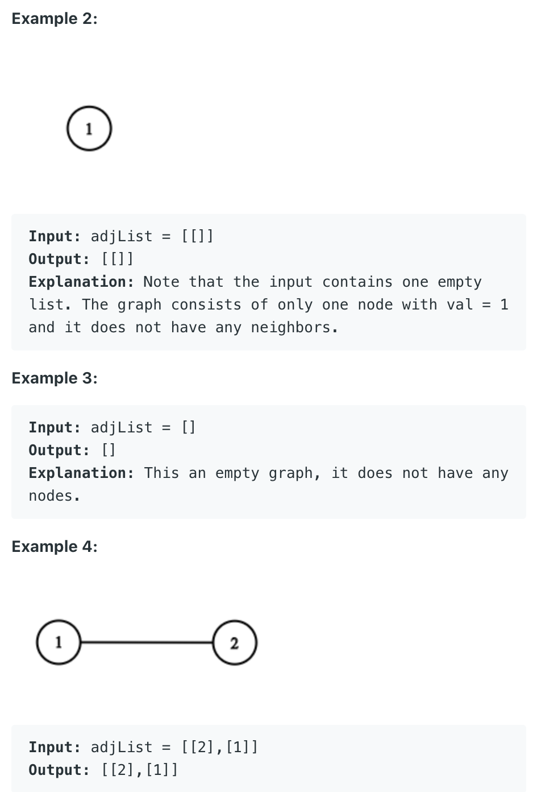
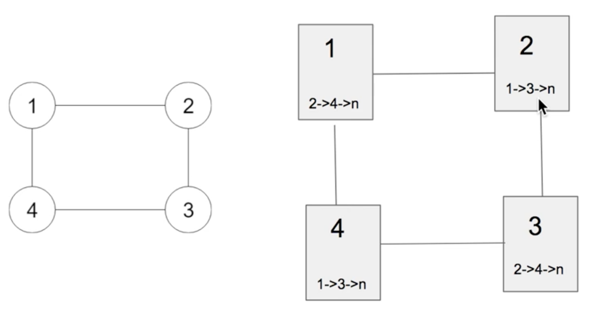
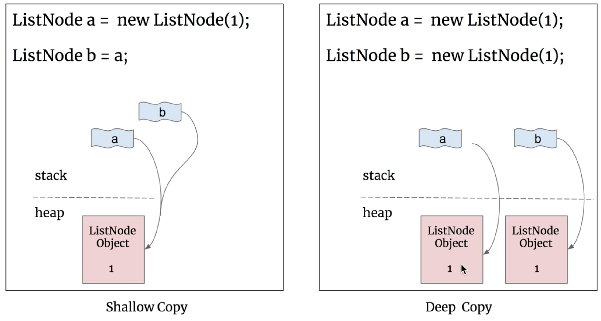
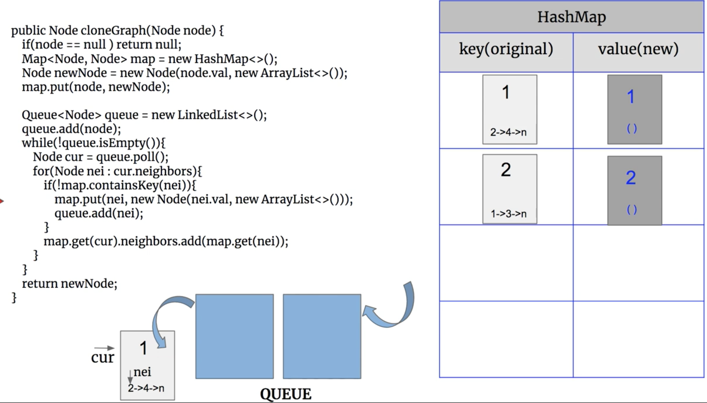
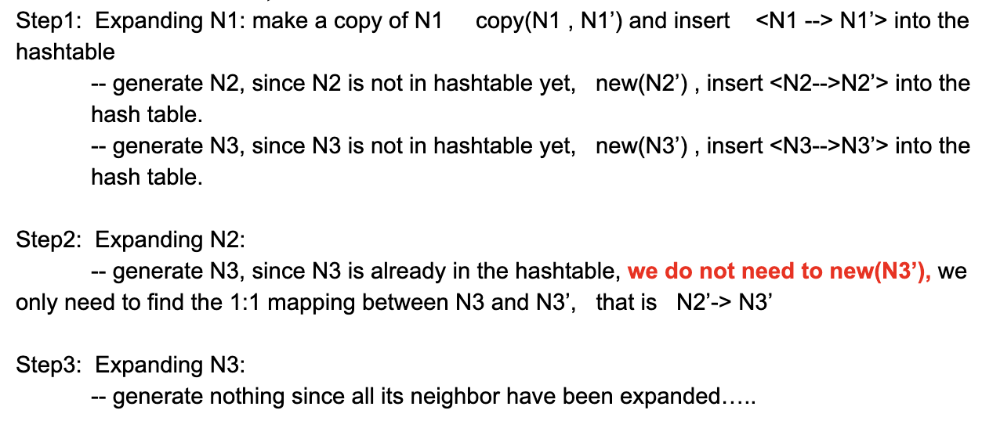
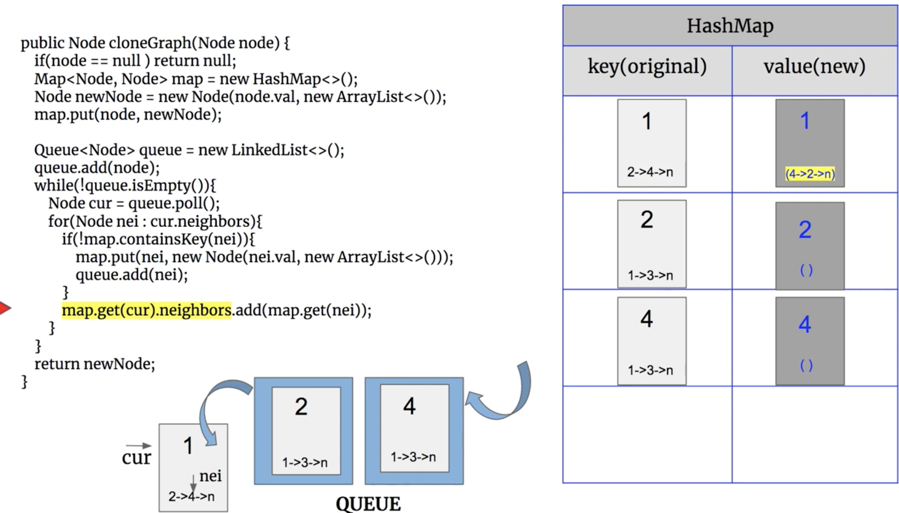
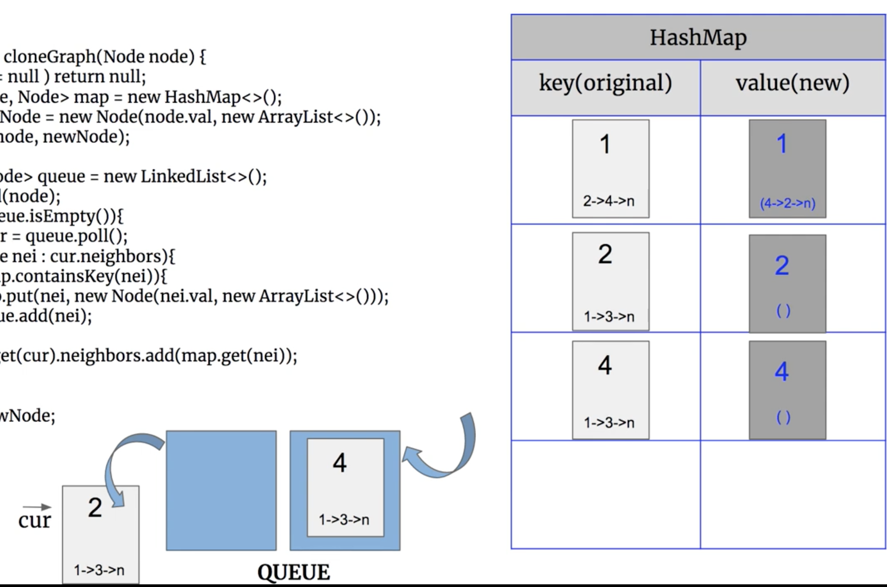

## 133. Clone Graph | Deep Copy Undirected Graph | BFS | DFS



---
## Analysis:

- Assumptions:
  - if grahp is null, return null



- Approach:



```ruby
N1  --  N2
  \     /
    N3

# deep copy 

N1'  --  N2'
  \     /
    N3'
```



- Method1: BFS








```java
/*
// Definition for a Node.
class Node {
    public int val;
    public List<Node> neighbors;
    
    public Node() {
        val = 0;
        neighbors = new ArrayList<Node>();
    }
    
    public Node(int _val) {
        val = _val;
        neighbors = new ArrayList<Node>();
    }
    
    public Node(int _val, ArrayList<Node> _neighbors) {
        val = _val;
        neighbors = _neighbors;
    }
}
*/


//BFS
class Solution {
    public Node cloneGraph(Node node) {
        if(node == null){
            return null;
        }
        Map<Node, Node> map = new HashMap<>();
        Queue<Node> queue = new ArrayDeque<>();
        map.put(node, new Node(node.val));
        queue.offer(node);
        while(!queue.isEmpty()){
            Node nei = queue.poll();
            for(Node neiNode : nei.neighbors){
                if(!map.containsKey(neiNode)){
                    map.put(neiNode, new Node(neiNode.val));
                    queue.offer(neiNode);
                }
                map.get(nei).neighbors.add(map.get(neiNode));
                
            }
        }
        return map.get(node);
    }
}
```


---

## DFS

```java
//DFS
class Solution {
    Map<Node, Node> map = new HashMap<>();
    
    public Node cloneGraph(Node node) {
        if (node == null) return node;
        
        return dfs(node);
    }
    
    private Node dfs(Node node) {
        if (node == null) return node;
        
        //1. 已经找到过这个node
        if (map.containsKey(node)) {
            return map.get(node);
        } else {//没有找到过这个node
            //copyNode's val
            Node copyNode = new Node(node.val);
            map.put(node, copyNode);
            //copyNode's neighbors
            List<Node> list = new ArrayList<>();
            for (Node nei : node.neighbors) {
                list.add(dfs(nei));
            }
            copyNode.neighbors = list;
            return copyNode;
        }
    }
}
```