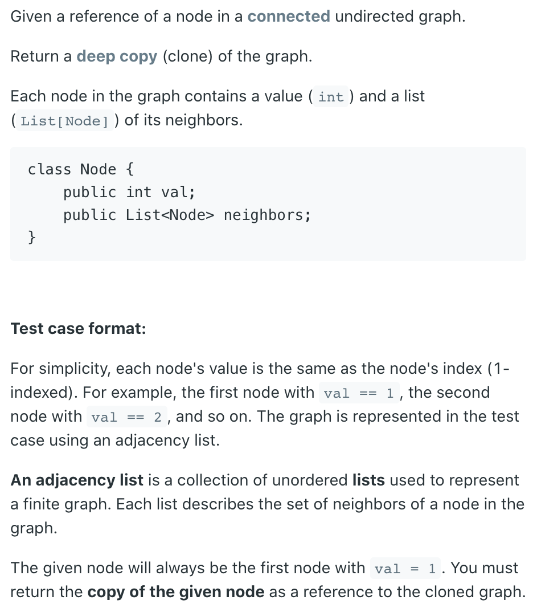

## 133. Clone Graph | Deep Copy Undirected Graph





---
## Analysis:

- Assumptions:
  - if grahp is null, return null

- Approach:


```ruby
N1  --  N2
  \     /
    N3

# deep copy 

N1'  --  N2'
  \     /
    N3'
```


- Method1: BFS


```java
/*
// Definition for a Node.
class Node {
    public int val;
    public List<Node> neighbors;
    
    public Node() {
        val = 0;
        neighbors = new ArrayList<Node>();
    }
    
    public Node(int _val) {
        val = _val;
        neighbors = new ArrayList<Node>();
    }
    
    public Node(int _val, ArrayList<Node> _neighbors) {
        val = _val;
        neighbors = _neighbors;
    }
}
*/

//BFS
class Solution {
    public Node cloneGraph(Node node) {
        if(node == null){
            return null;
        }
        Map<Node, Node> map = new HashMap<>();
        Queue<Node> queue = new ArrayDeque<>();
        map.put(node, new Node(node.val));
        queue.offer(node);
        while(!queue.isEmpty()){
            Node nei = queue.poll();
            for(Node neiNode : nei.neighbors){
                if(!map.containsKey(neiNode)){
                    map.put(neiNode, new Node(neiNode.val));
                    queue.offer(neiNode);
                }
                map.get(nei).neighbors.add(map.get(neiNode));
                
            }
        }
        return map.get(node);
    }
}
```

---

## DFS

```java
//DFS
class Solution {
    public Node cloneGraph(Node node) {
        if(node == null){
            return null;
        }
        Map<Node, Node> map = new HashMap<>();
        map.put(node, new Node(node.val));
        DFS(node, map);
        return map.get(node);
    }
    
    private void DFS(Node seed, Map<Node, Node> map){
        Node copy = map.get(seed);
        for(Node nei : seed.neighbors){
            if(!map.containsKey(nei)){
                map.put(nei, new Node(nei.val));
                DFS(nei, map);
            }
            copy.neighbors.add(map.get(nei));
        }
    }
}
```