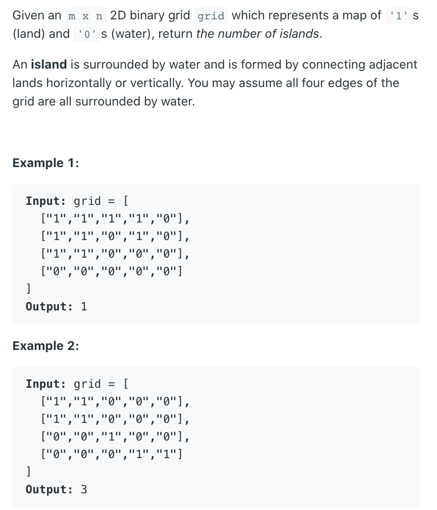
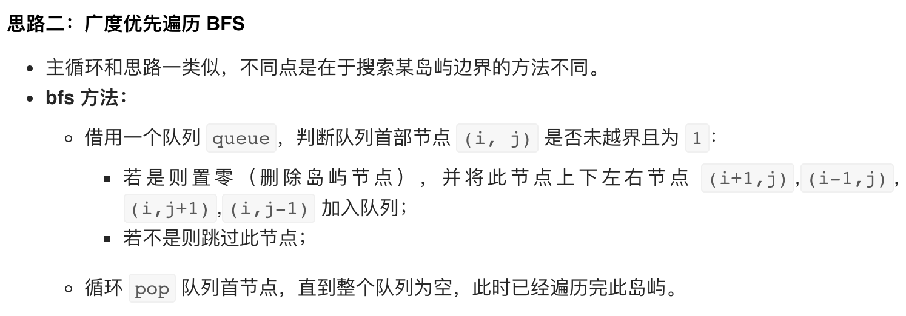

## 200. Number of Islands





```java
class Solution {
    public int numIslands(char[][] grid) {
        if (grid == null || grid.length == 0) {
          return 0;
        }
        int m = grid.length;
        int n = grid[0].length;
        int count = 0;
        for (int row = 0; row < m; row++) {
            for (int col = 0; col < n; col++) {
                if (grid[row][col] == '1') {
                    bfs(grid, row, col);
                    count++;
                }
            }
        }
        return count;
    }
    
    private void bfs(char[][]grid, int row, int col){
        Queue<int[]> queue = new ArrayDeque<>();
        queue.offer(new int[] {row, col});
        while (!queue.isEmpty()) {
            int[] cur = queue.poll();
            int r = cur[0];
            int c = cur[1];
            if(r >= 0 && r < grid.length && c >= 0 && 
               c < grid[0].length && grid[r][c] == '1'){
                grid[r][c] = '0';
                queue.offer(new int[] {r, c - 1});
                queue.offer(new int[] {r, c + 1});
                queue.offer(new int[] {r - 1, c});
                queue.offer(new int[] {r + 1, c});                
            }
        }
    }
}
```