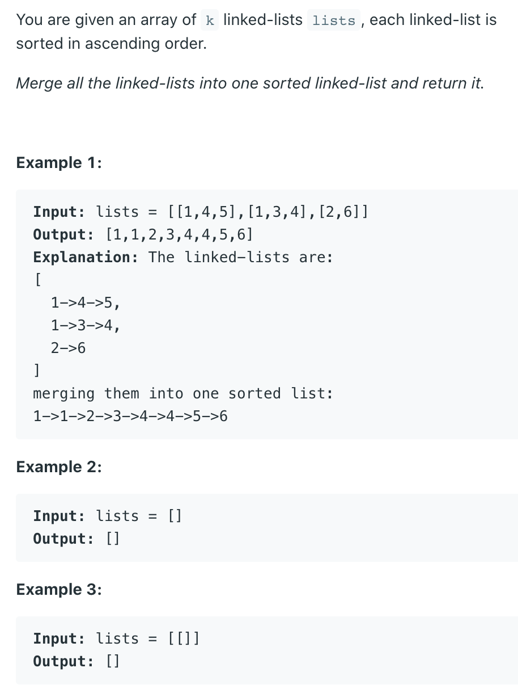

## 23. Merge k Sorted Lists



---

- step 1: minHeap.offer(all ListNode[])
- step 2: if current array's next node is not null,
  minHeap.offer(next.next)
- step 3: cur = cur.next

```ruby
lists = [[1,4,5],[1,3,4],[2,6]]

minHeap<arr[0].[0], arr[1].[0], arr[2].[0] >
cur -> 1 ...

minHeap<arr[0].[1], arr[0].[2], arr[1].[0], arr[2].[0] >
...
```
---

```java
/**
 * Definition for singly-linked list.
 * public class ListNode {
 *     int val;
 *     ListNode next;
 *     ListNode() {}
 *     ListNode(int val) { this.val = val; }
 *     ListNode(int val, ListNode next) { this.val = val; this.next = next; }
 * }
 */
class Solution {
    public ListNode mergeKLists(ListNode[] lists) {
      if (lists == null || lists.length == 0) {
          return null;
      }
      PriorityQueue<ListNode> minHeap = 
        new PriorityQueue<>(lists.length, new Comparator<ListNode>(){
          @Override
          public int compare(ListNode o1, ListNode o2) {
            if (o1.val == o2.val) {
              return 0;
            }
            return o1.val < o2.val ? -1 : 1;
          }
        });
      
      ListNode dummy = new ListNode(0);
      ListNode cur = dummy;
      for (ListNode node : lists) {
        if (node != null) {
          minHeap.offer(node);
        }
      }
      
      while (!minHeap.isEmpty()) {
        cur.next = minHeap.poll();
        if (cur.next.next != null) {
          minHeap.offer(cur.next.next);
        }
        cur = cur.next;
      }
      return dummy.next;
    }
}
```