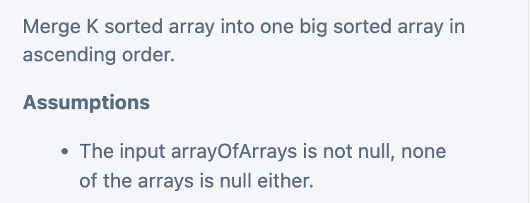

## Merge K Sorted Array

- [Link](https://app.laicode.io/app/problem/133)

```java
/**
 *
 * Merge K sorted array into one big sorted array in ascending order.
 * Assumptions: The input arrayOfArrays is not null, none of the arrays is null either.
 * Input:
 * [[1, 10, 11, 15],
 * [2,  4,  9, 14],
 * [5,  6,  8, 16],
 * [3,  7, 12, 13]]
 * <p>
 * Output: [1, 2, 3, 4, 5, 6, 7, 8, 9, 10, 11, 12, 13, 14, 15, 16]
 * <p>
 * Solution: use heap to find the minimum, 谁小移谁 (加入result array)
 * <p>
 * Entries in the heap need to include information about:
 * Value - heap priority is determined by the value
 * Index - helps to locate the next index
 * <p>
 * PQ: [<(2, 0), 5>, <(3, 0), 3>, <(0, 1), 10>, <(1, 1), 4>]
 * <p>
 * result: 1, 2
 *  Time: O(nlogK) - n is the total of all elements
 *  Space: O(k) - heap
 */
class Merge_K_SortedArray {
    static class Entry {
        // row
        int x;
        // column
        int y;
        // the corresponding value.
        int val;

        Entry(int x, int y, int val) {
            this.x = x;
            this.y = y;
            this.val = val;
        }
    }

    static class MyComparator implements Comparator<Entry> {
        @Override
        public int compare(Entry o1, Entry o2) {
            if (o1.val == o2.val) {
                return 0;
            }
            return o1.val < o2.val ? -1 : 1;
        }
    }


    public int[] merge(int[][] arrayOfArrays) {
        // Write your solution here
        PriorityQueue<Entry> minHeap = new PriorityQueue<>(10, new MyComparator());
        int length = 0;
        for (int i = 0; i < arrayOfArrays.length; i++) {
            int[] array = arrayOfArrays[i];
            length += array.length;
            if (array.length != 0) {
                // we use two index to record the position of each elment:
                // the index of the array in the arrayOfArrays,
                // the index of the element in the array
                minHeap.offer(new Entry(i, 0, array[0]));
            }
        }
        int[] result = new int[length];
        int idx = 0;
        while (!minHeap.isEmpty()) {
            Entry temp = minHeap.poll();
            result[idx++] = temp.val;
            if (temp.y + 1 < arrayOfArrays[temp.x].length) {
                // reuse the same Entry object but advance the index by 1.
                temp.y++;
                temp.val = arrayOfArrays[temp.x][temp.y];
                minHeap.offer(temp);
            }
        }
        return result;
    }

    public static void main(String[] args) {
        int[][] arrayOfArrays = new int[][] {
                {1, 10, 11, 15},
                {2,  4,  9, 14},
                {5,  6,  8, 16},
                {3,  7, 12, 13}
        };
        Merge_K_SortedArray mksa = new Merge_K_SortedArray();
        int[] res = mksa.merge(arrayOfArrays);
        System.out.println(Arrays.toString(res));
        // [1, 2, 3, 4, 5, 6, 7, 8, 9, 10, 11, 12, 13, 14, 15, 16]
    }
}

```