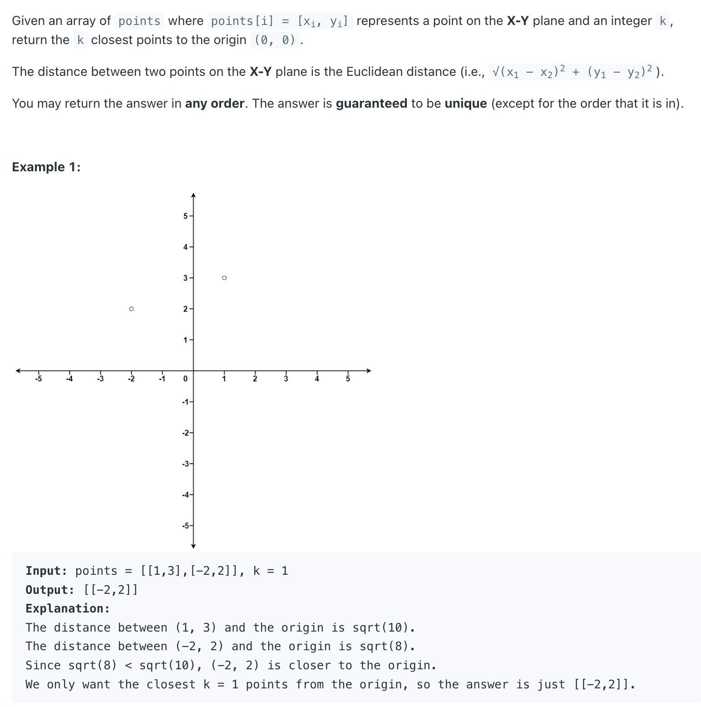
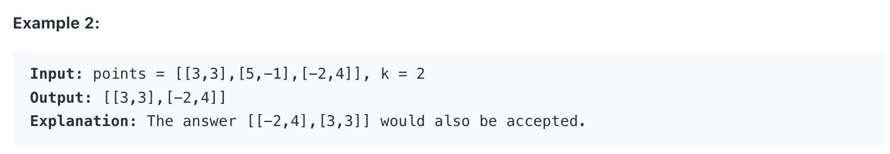

## 973. K Closest Points to Origin


---

```java
class Solution {
    public int[][] kClosest(int[][] points, int k) {
        int[][] res = new int[k][2];
        PriorityQueue<int[]> maxHeap = new PriorityQueue<>(
            (a, b) -> (b[0] * b[0] + b[1] * b[1]) -  (a[0] * a[0] + a[1] * a[1]) 
        );
        
        for (int[] point : points) {
            maxHeap.offer(point);
            if (maxHeap.size() > k) {
                maxHeap.poll();
            }
        }
        
        while (k > 0) {
            res[--k] = maxHeap.poll();
        }
        return res;
    }
}
```