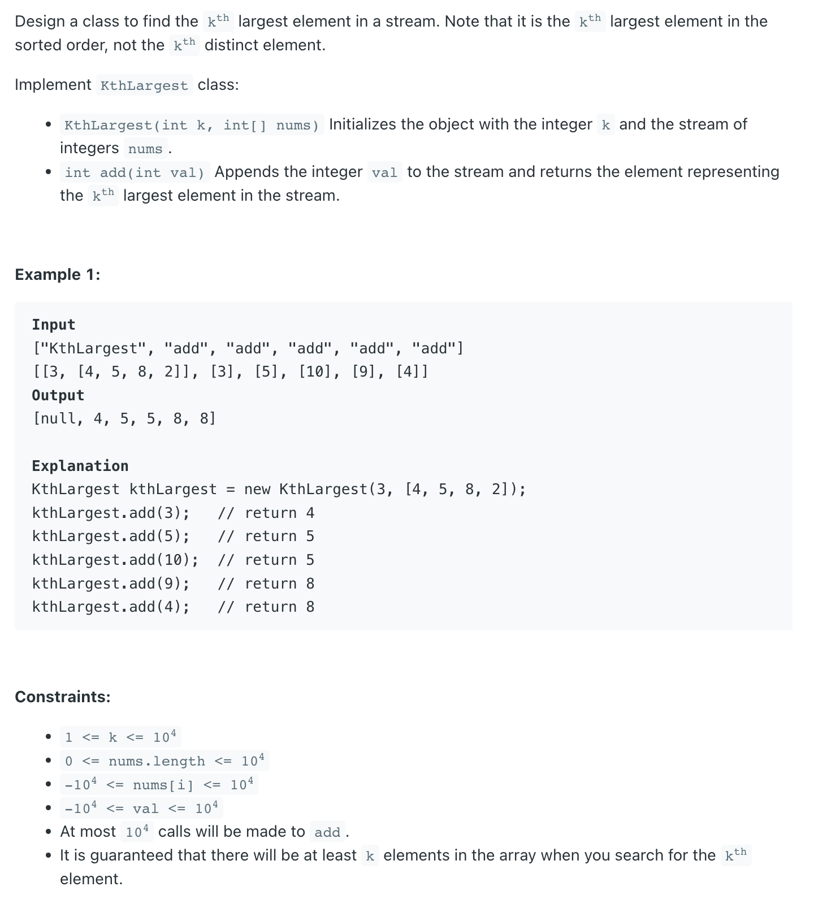

## 703. Kth Largest Element in a Stream


```java
class _703_KthLargestElementIn_Stream {
    PriorityQueue<Integer> minHeap;
    int k;

    public _703_KthLargestElementIn_Stream(int k, int[] nums) {
        this.k = k;
        minHeap = new PriorityQueue<>();
        for (int num : nums) {
            add(num);
        }
    }

    public int add(int val) {
        if (minHeap.size() < k) {
            minHeap.offer(val);
        } else if (minHeap.size() >= k) {
            if (val > minHeap.peek()) {
                minHeap.offer(val);
                minHeap.poll();
            }
        }
        return minHeap.peek();
    }

    // public int add(int val) {
    //     if (minHeap.size() < this.k) {
    //         minHeap.offer(val);
    //     } else if (minHeap.peek() < val) {
    //         minHeap.offer(val);
    //         minHeap.poll();
    //     }
    //     return minHeap.peek();
    // }

    public static void main(String[] args) {
        int[] nums = new int[]{4, 5, 8, 2};
        _703_KthLargestElementIn_Stream kthLargest = new _703_KthLargestElementIn_Stream(3, nums);
        System.out.println(kthLargest.add(3));
        System.out.println(kthLargest.add(5));
        System.out.println(kthLargest.add(10));
        System.out.println(kthLargest.add(9));
        System.out.println(kthLargest.add(4));
    }
}
```

---

### Brute Force

```java
class KthLargest {
    
    PriorityQueue<Integer> maxHeap = new PriorityQueue<>((a, b) -> b - a);
    int k;
    List<Integer> temp;

    public KthLargest(int k, int[] nums) {
        this.k = k;
        for (int num : nums) {
            maxHeap.offer(num);
        }
    }
    
    public int add(int val) {
        int kth = 0;
        maxHeap.offer(val);
        temp = new ArrayList<>();
        for (int i = 0; i < k - 1; i++) {
            temp.add(maxHeap.poll());
        }
        int res = maxHeap.peek();
        for (int i = 0; i < temp.size(); i++) {
            maxHeap.offer(temp.get(i));
        }
        return res;
    }
}
```