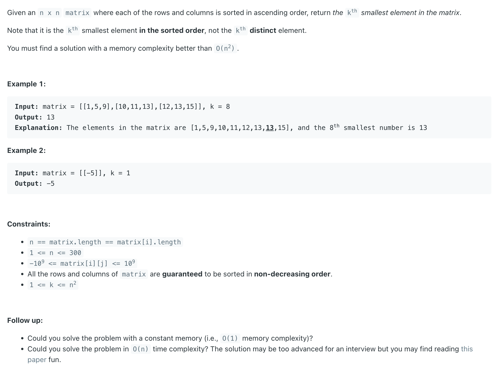
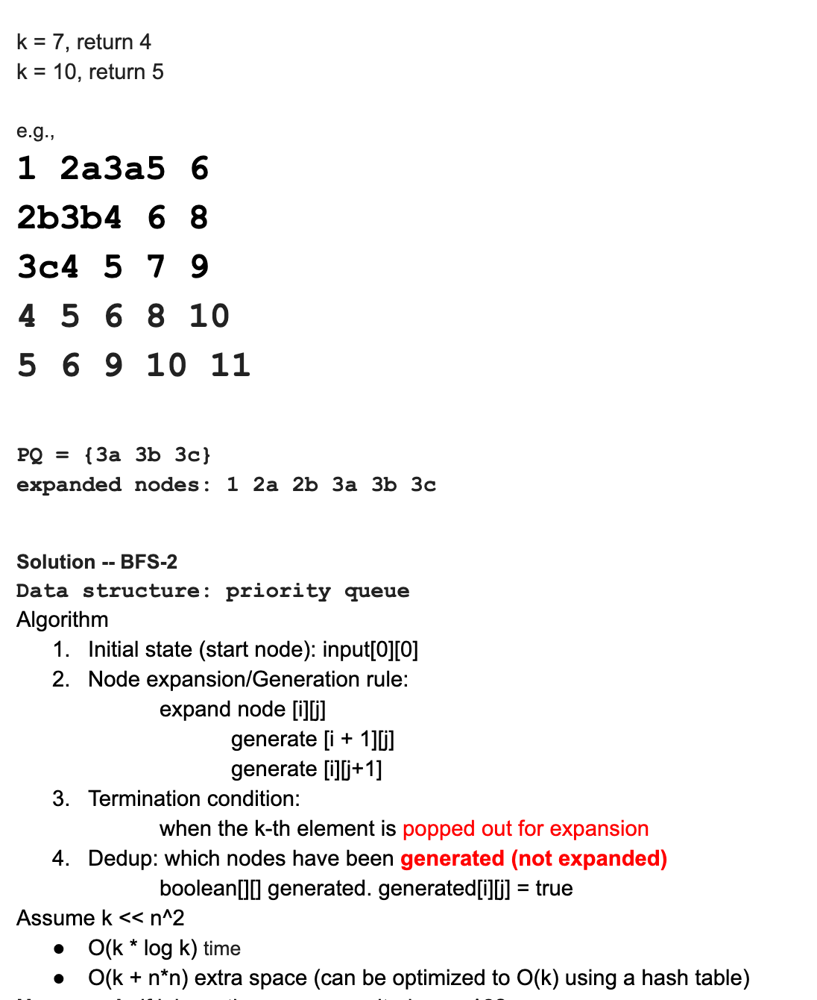
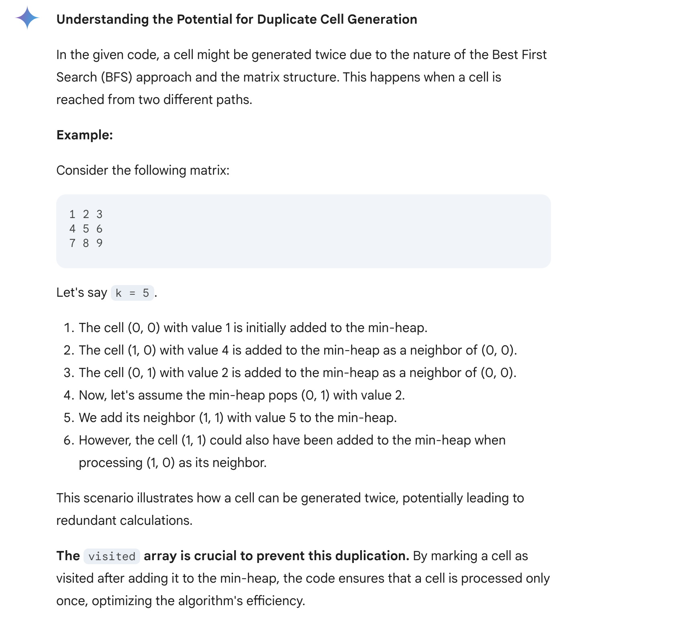

## 378. Kth Smallest Element in a Sorted Matrix | Best FS


---

## Analysis:

- 注意审题： 
  - each of the **rows is sorted in ascending order**
  - each of the **columns is sorted in ascending order**

---



---

```java
class _KthSmallestElement_In_SortedMatrix_no_lambda {
    public int kthSmallest(int[][] matrix, int k) {
        // Write your solution here
        int rows = matrix.length;
        int columns = matrix[0].length;
        //Best First Search, need a minHeap on the value of each cells.
        PriorityQueue<Cell> minHeap = new PriorityQueue<Cell>(k, new Comparator<Cell>(){
            @Override
            public int compare(Cell c1, Cell c2){
                if(c1.val == c2.val){
                    return 0;
                }
                return c1.val < c2.val ? -1 : 1;
            }
        });

        //all the generated cells will be marked true,
        //to avoid being generated more than once.
        boolean[][] visited = new boolean[rows][columns];
        minHeap.offer(new Cell(0, 0, matrix[0][0]));
        visited[0][0] = true;
        //iterate k-1 rounds, and Best First Search the smallest k-1 cells
        for(int i=0; i<k-1; i++){
            Cell cur = minHeap.poll();
            //the neighbor cell will be inserted back to the minheap only if
            //1. it is not out of boundary
            //2. it has not been generated before
            //Because for each cell it could be generated twice.
            if(cur.row + 1 < rows && !visited[cur.row + 1][cur.column]){
                minHeap.offer(
                        new Cell(cur.row + 1, cur.column, matrix[cur.row + 1][cur.column])
                );
                visited[cur.row + 1][cur.column] = true;
            }
            if(cur.column + 1 < columns && !visited[cur.row][cur.column + 1]){
                minHeap.offer(
                        new Cell(cur.row, cur.column + 1, matrix[cur.row][cur.column+1])
                );
                visited[cur.row][cur.column + 1] = true;
            }
        }
        return minHeap.peek().val;
    }

    class Cell{
        int row;
        int column;
        int val;

        Cell(int row, int column, int val){
            this.row = row;
            this.column = column;
            this.val = val;
        }
    }
}
```
---

#### Python

```py
class Cell:
    def __init__(self, row: int, col: int, val: int):
        self.row = row
        self.col = col
        self.val = val

    # Define the comparator for the min heap based on the cell value
    def __lt__(self, other):
        if self.val < other.val:
            return True
        # return self.val < other.val

class Solution:
    def kthSmallest(self, matrix: List[List[int]], k: int) -> int:
        rows = len(matrix)
        cols = len(matrix[0])

        # minHeap initialization
        minHeap = []
        heapq.heappush(minHeap, Cell(0, 0, matrix[0][0]))

        # Visited array to avoid processing the same cell twice
        visited = [[False] * cols for _ in range(rows)]
        visited[0][0] = True

        # Process the first k-1 smallest elements
        for _ in range(k - 1):
            cur = heapq.heappop(minHeap)

            # Check the downward neighbor
            if cur.row + 1 < rows and not visited[cur.row + 1][cur.col]:
                heapq.heappush(minHeap, Cell(cur.row + 1, cur.col, matrix[cur.row + 1][cur.col]))
                visited[cur.row + 1][cur.col] = True

            # Check the rightward neighbor
            if cur.col + 1 < cols and not visited[cur.row][cur.col + 1]:
                heapq.heappush(minHeap, Cell(cur.row, cur.col + 1, matrix[cur.row][cur.col + 1]))
                visited[cur.row][cur.col + 1] = True

        return minHeap[0].val
```