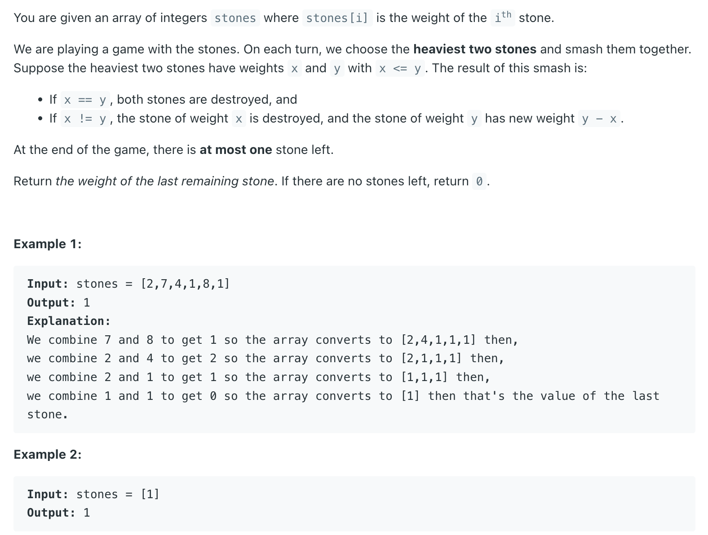

## 1046. Last Stone Weight

---
```java
class Solution {
    public int lastStoneWeight(int[] stones) {
        PriorityQueue<Integer> maxHeap = new PriorityQueue<>((a, b) -> b - a);
        for (int stone : stones) {
            maxHeap.offer(stone);
        }
        while (maxHeap.size() > 1) {
            int x = maxHeap.poll();
            int y = maxHeap.poll();
            if (x == y) {
                maxHeap.add(0);
            }
            if (x != y) {
                maxHeap.add(x - y);
            }
        }
        
        return maxHeap.peek();
    }
}
```


---
### version 2

```java
class Solution {
    public int lastStoneWeight(int[] stones) {
        PriorityQueue<Integer> maxHeap = new PriorityQueue<>((a, b) -> b - a);
        for (int stone : stones) {
            maxHeap.offer(stone);
        }
        
        while (maxHeap.size() > 1) {
            int y = maxHeap.poll(), x = maxHeap.poll();
            maxHeap.offer(y - x);            
        }
        return maxHeap.poll();
    }
}
```