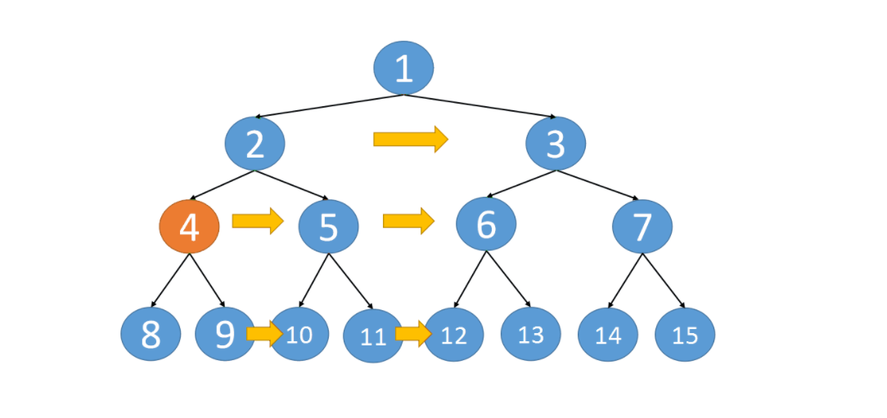

## 116. Populating Next Right Pointers in Each Node


```java
/*
// Definition for a Node.
class Node {
    public int val;
    public Node left;
    public Node right;
    public Node next;

    public Node() {}
    
    public Node(int _val) {
        val = _val;
    }

    public Node(int _val, Node _left, Node _right, Node _next) {
        val = _val;
        left = _left;
        right = _right;
        next = _next;
    }
};
*/

class Solution {
    public Node connect(Node root) {
        if (root == null) {
            return root;
        }     
        Queue<Node> queue = new ArrayDeque<>();
        queue.offer(root);
        while (!queue.isEmpty()) {
            int size = queue.size();
            for (int i = 0; i < size; i++) {
                Node cur = queue.poll();
                if (i < size - 1) {
                    cur.next = queue.peek();                    
                }
                if (cur.left != null) {
                    queue.offer(cur.left);
                }
                if (cur.right != null) {
                    queue.offer(cur.right);
                }
            }
        }
        return root;
    }
}
```

---

### Recursive Method




- Time = O(n)
- Space = O(h)


```java
class Solution {
    public Node connect(Node root) {     
        dfs(root);
        return root;
    }
    
    private void dfs(Node root) {
        if (root == null) {
            return;
        }
        Node left = root.left;
        Node right = root.right;
        while (left != null) {
            left.next = right;
            left = left.right;
            right = right.left;
        }
        
        dfs(root.left);
        dfs(root.right);
    }
}
```

