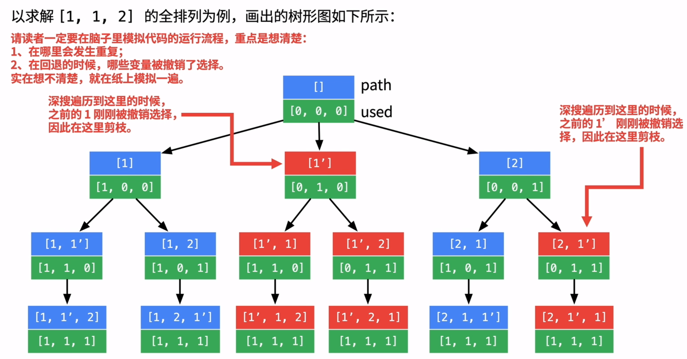

## 47. Permutations II | DFS

```java
Given a collection of numbers that might contain duplicates, 
return all possible unique permutations.


Example:
Input: [1,1,2]
Output:
[
  [1,1,2],
  [1,2,1],
  [2,1,1]
]
```

## Analysis:

- [all permutations | DFS](https://novemberfall.github.io/LeetCode-NoteBook/#/m6/permutationsWithStr)
- if `index == nums.length - 1`, 这样没有cover到set = “” 的corner case， 
  set="" 的时候应该返回[""]，

- 也可以加上这个条件：

```java
if (set == "") {
    result.add("");
    return result;
}
```


- 利用一个set, 去重， 当遇到重复元素时，我们直接跳过 current index, 进行下一loop 操作
- 递归前后继续保持一致状态，所以调用两次 swap()

- Time = O(n * n!)

- Space = O(n^2)
  - n + (n - 1) + (n - 2) + (n - 3) + ... = O(n^2)
---




```java
/*
                    []
     /              |             \
  1(1, 2)        1(1, 2)        2(1, 1)
   /   \           /  \          /   \
 1(2)  2(1)     1(2)  2(1)     1(1)  1(1)
  |      |        |     |       |      |
  2      1        2     1       1      1

*/


class Solution {
    public List<List<Integer>> permuteUnique(int[] nums) {
        List<List<Integer>> res = new ArrayList<>();
        if(nums == null || nums.length == 0){
            return res;
        }
        dfs(res, nums, 0);
        return res;       
    }
    
    private void dfs(List<List<Integer>> res, int[] nums, int index){
        if(index == nums.length){
            List<Integer> list = new ArrayList<>();
            for(int num : nums){
                list.add(num);
            }
            res.add(list);
            return;
        }
        
        Set<Integer> used = new HashSet<>();
        for(int i = index; i < nums.length; i++){
            if(used.contains(nums[i])){
                continue;
            }
            used.add(nums[i]);
            
            swap(nums, index, i);
            dfs(res, nums, index + 1);
            swap(nums, index, i);
        }
    }
    
    private void swap(int[]nums, int left, int right){
        int tmp = nums[left];
        nums[left] = nums[right];
        nums[right] = tmp;
    }
}
```

---

### 2nd method

```java
class Solution {
    public List<List<Integer>> permuteUnique(int[] nums) {
        List<List<Integer>> res = new ArrayList<>();
        dfs(nums, 0, res);
        return res;
    }
    
    private void dfs(int[]nums, int index ,List<List<Integer>> res) {
        if (index == nums.length) {
            List<Integer> cur = new ArrayList<>();
            for (int num : nums) {
                cur.add(num);
            }
            res.add(cur);
            return;
        }
        Set<Integer> used = new HashSet<>();
        for (int i = index; i < nums.length; i++) {
            if (used.add(nums[i])) {
                swap(nums, index, i);
                dfs(nums, index+1, res);
                swap(nums, index, i);                
            }
        }
    }
    
    private void swap(int[] nums, int index, int i) {
        int tmp = nums[index];
        nums[index] = nums[i];
        nums[i] = tmp;
    }
}
```