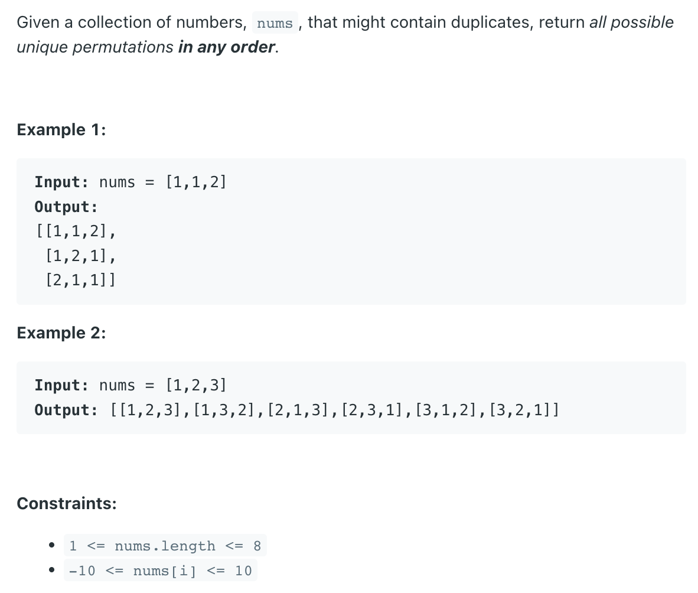
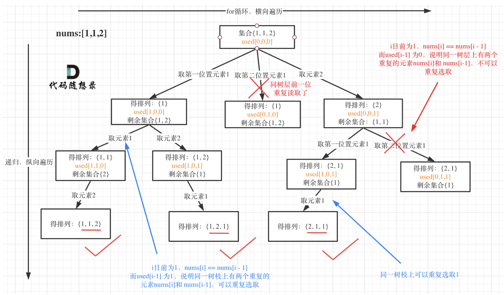

## 47. Permutations II | DFS


## Analysis:



- [liweiwei | 回溯搜索 + 剪枝 | LeetCode 题解](https://leetcode.cn/problems/permutations-ii/solution/hui-su-suan-fa-python-dai-ma-java-dai-ma-by-liwe-2/)
- [jiu zhang 全排列II]()

```java
class Solution {
    public List<List<Integer>> permuteUnique(int[] nums) {
        List<List<Integer>> res = new ArrayList<>();
        if (nums == null || nums.length == 0) return res;
        
        Arrays.sort(nums);
        boolean[] visited = new boolean[nums.length];
        dfs(nums, visited, res, new ArrayList<>());
        return res;
    }
    
    private void dfs(int[] nums, boolean[] visited, List<List<Integer>> res, List<Integer> perm) {
        if (perm.size() == nums.length) {
            res.add(new ArrayList<>(perm));
            return;
        }
        
        for (int i = 0; i < nums.length; i++) {
            if (visited[i]) {
                continue;
            }
            if (i > 0 && nums[i - 1] == nums[i] && !visited[i - 1]) {
                continue;
            }
            
            perm.add(nums[i]);
            visited[i] = true;
            dfs(nums, visited, res, perm);
            visited[i] = false;
            perm.remove(perm.size() - 1);
        }
    }
}
```

---
- if `index == nums.length - 1`, 这样没有cover到set = “” 的corner case， 
  set="" 的时候应该返回[""]，

- 也可以加上这个条件：

```java
if (set == "") {
    result.add("");
    return result;
}
```


- 利用一个set, 去重， 当遇到重复元素时，我们直接跳过 current index, 进行下一loop 操作
- 递归前后继续保持一致状态，所以调用两次 swap()

- Time = O(n * n!)

- Space = O(n^2)
  - n + (n - 1) + (n - 2) + (n - 3) + ... = O(n^2)
---

```java
/*
                    []
     /              |             \
  1(1, 2)        1(1, 2)        2(1, 1)
   /   \           /  \          /   \
 1(2)  2(1)     1(2)  2(1)     1(1)  1(1)
  |      |        |     |       |      |
  2      1        2     1       1      1

*/


class Solution {
    public List<List<Integer>> permuteUnique(int[] nums) {
        List<List<Integer>> res = new ArrayList<>();
        if(nums == null || nums.length == 0){
            return res;
        }
        dfs(res, nums, 0);
        return res;       
    }
    
    private void dfs(List<List<Integer>> res, int[] nums, int index){
        if(index == nums.length){
            List<Integer> list = new ArrayList<>();
            for(int num : nums){
                list.add(num);
            }
            res.add(list);
            return;
        }
        
        Set<Integer> used = new HashSet<>();
        for(int i = index; i < nums.length; i++){
            if(used.contains(nums[i])){
                continue;
            }
            used.add(nums[i]);
            
            swap(nums, index, i);
            dfs(res, nums, index + 1);
            swap(nums, index, i);
        }
    }
    
    private void swap(int[]nums, int left, int right){
        int tmp = nums[left];
        nums[left] = nums[right];
        nums[right] = tmp;
    }
}
```

---

