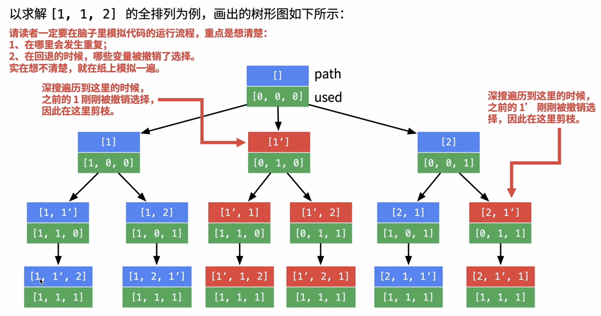

## All Permutations II | DFS

```ruby
Given a string with possible duplicate characters, 
return a list with all permutations of the characters.

Examples

Set = “abc”, all permutations are [“abc”, “acb”, “bac”, “bca”, “cab”, “cba”]
Set = "aba", all permutations are ["aab", "aba", "baa"]
Set = "", all permutations are [""]
Set = null, all permutations are []
```

## Analysis:

- [具体分析可以参考 47. Permutations II | DFS](https://novemberfall.github.io/LeetCode-NoteBook/#/m6/permutationsII)




```java
public class Solution {
  public List<String> permutations(String input) {
    // Write your solution here
    List<String> res = new ArrayList<>();
    if(input == null){
      return res;
    }
    char[] array = input.toCharArray();
    dfs(array, 0, res);
    return res;
  }

  private void dfs(char[] array, int index, List<String> res){
    if(index == array.length){
      res.add(new String(array));
      return;
    }

    Set<Character> used = new HashSet<>();
    for(int i = index; i<array.length; i++){
      if(used.contains(array[i])){
        continue;
      }
      used.add(array[i]);
      swap(array, i, index);
      dfs(array, index + 1, res);
      swap(array, i, index);
    }
  }

  private void swap(char[] array, int left, int right){
    char tmp = array[left];
    array[left] = array[right];
    array[right] = tmp;
  }
}

```