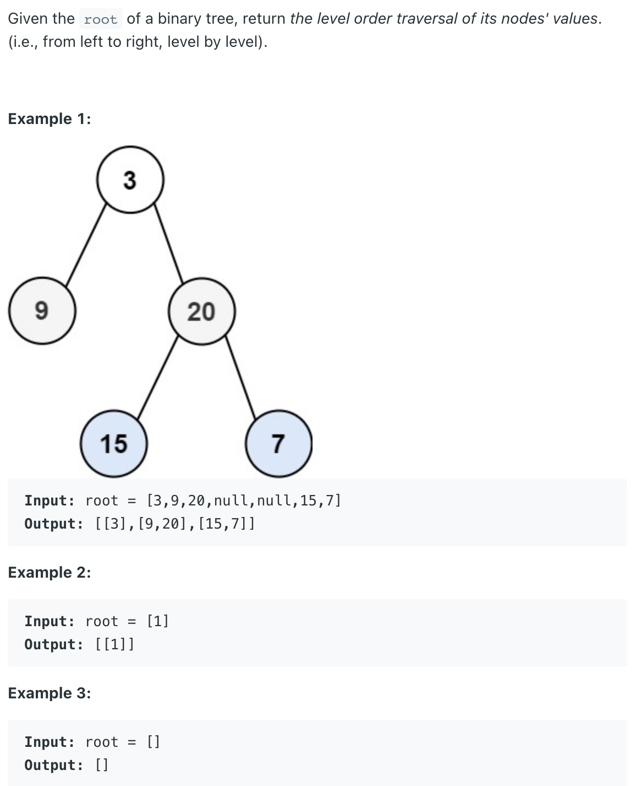
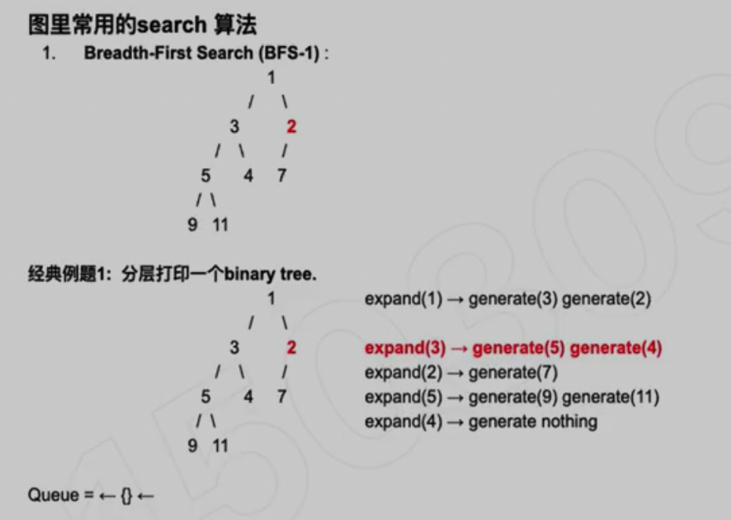
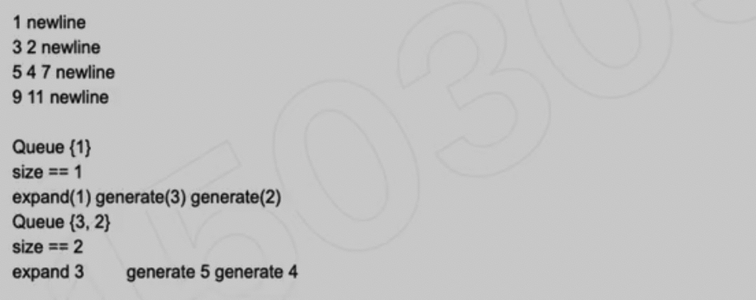
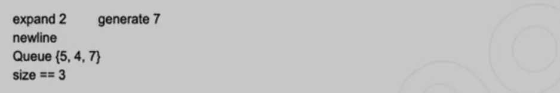
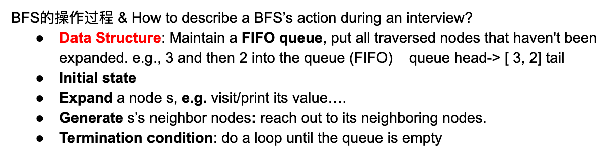
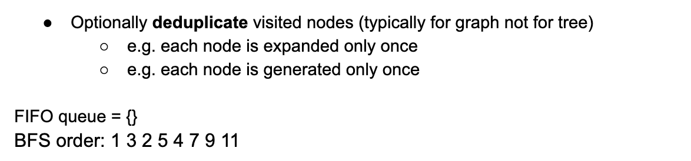

## 102. Binary Tree Level Order Traversal | Get Keys In Binary Tree Layer By Layer


---
```java
/**
 * public class TreeNode {
 *   public int key;
 *   public TreeNode left;
 *   public TreeNode right;
 *   public TreeNode(int key) {
 *     this.key = key;
 *   }
 * }
 */
public class Solution {
  public List<List<Integer>> layerByLayer(TreeNode root) {
    // Write your solution here
    List<List<Integer>> list = new ArrayList<>();
    if(root == null){
      return list;
    }

    Queue<TreeNode> queue = new ArrayDeque<>();
    queue.offer(root);
    while(!queue.isEmpty()) {
      List<Integer> curLayer = new ArrayList<>();
      int size = queue.size();
      for(int i = 0; i < size; i++){
        TreeNode cur = queue.poll();
        curLayer.add(cur.key);
        if(cur.left != null){
          queue.offer(cur.left);
        }
        if(cur.right != null){
          queue.offer(cur.right);
        }
      }
      list.add(curLayer);
    }
    return list;
  }
}

```

---

### Analysis:



```ruby
expand: 中心开花, 往外延展

                1   expand(1) -> generate(3) and generate(2)    
              /    \
             3      2
           /  \    /
          5    4  7
         / \
        9  11

Output:
1       newline
3 2     newline
5 4 7           newline
9 11    newline


Data structure: FIFO queue
Algorithm: BFS1

Initialization: queue = {root}
For each step:
1. Record the size (=k) of the queue
2. k次 expand + generate
```







---

```java
//param: root - the root of the tree
public void PrintNodeByLevel(Node root){
        if(root == null){
                return;
        }
        Queue<Node> q = new ArrayDeque<Node>();
        q.offer(root);
        while(!q.empty()){
                int size = q.size(); 
                //size = # of nodes in the current layer.
                for(int i = 0; i<size; i++){
                        Node n = q.poll();
                        if(n.left != null){
                                q.offer(n.left);
                        }
                        if(n.right != null){
                                q.offer(n.right);
                        }
                        System.out.print(n.val + " ");
                }
                System.out.println();
        }
}
```


- Time Complexity = `O(n)`
- space Complexity = `O(n)`

