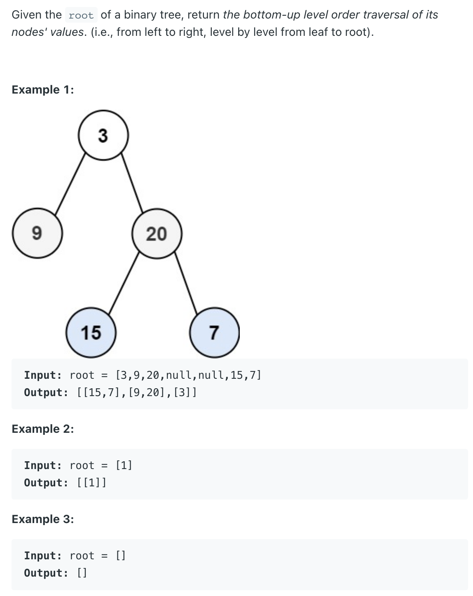

## 107. Binary Tree Level Order Traversal II

---
- 具体分析可以参考 [102. Binary Tree Level Order Traversal](https://novemberfall.github.io/LeetCode-NoteBook/#/m6/printByLayer)

- 唯一不同点在于， `ArrayList.add(0, list)` => 把最先的这一层元素全部加到第一个，然后下一次又加在第一个
- 最后得到 倒叙结果


```java
/**
 * Definition for a binary tree node.
 * public class TreeNode {
 *     int val;
 *     TreeNode left;
 *     TreeNode right;
 *     TreeNode() {}
 *     TreeNode(int val) { this.val = val; }
 *     TreeNode(int val, TreeNode left, TreeNode right) {
 *         this.val = val;
 *         this.left = left;
 *         this.right = right;
 *     }
 * }
 */
class Solution {
    public List<List<Integer>> levelOrderBottom(TreeNode root) {
        List<List<Integer>> result = new ArrayList<>();
        if(root == null){
            return result;
        }
        Queue<TreeNode> queue = new ArrayDeque<>();
        queue.offer(root);
        while(!queue.isEmpty()){
            List<Integer> list = new ArrayList<>();
            int size = queue.size();
            for(int i=0; i<size; i++){
                TreeNode current = queue.poll();             
                list.add(current.val);
                if(current.left != null){
                    queue.offer(current.left);
                }
                if(current.right != null){
                    queue.offer(current.right);
                }
            }
            result.add(0, list);            
        }
        return result;
    }
}
```


---

## 一个变种题目

```ruby
Given a binary tree, return the bottom-up level order 
traversal of its nodes' values, from left to right. 
Only need to return lowest level 

Example:

    Given the below binary tree


              5

          /        \

        3            8

      /    \           \

    1       4          11

 return its bottom-up level order traversal as:

[1, 4, 11],
```


- my ans:

```java
/**
 * public class TreeNode {
 *   public int key;
 *   public TreeNode left;
 *   public TreeNode right;
 *   public TreeNode(int key) {
 *     this.key = key;
 *   }
 * }
 */
public class Solution {
  public List<Integer> levelOrderBottom(TreeNode root) {
    // Write your solution here
    List<List<Integer>> result = new ArrayList<>();
    List<Integer> temp = new ArrayList<>();
    if(root == null){
      return temp;
    }
    Queue<TreeNode> queue = new ArrayDeque<>();
    queue.offer(root);
    while(!queue.isEmpty()){
      List<Integer> list = new ArrayList<>();
      int size = queue.size();
      for(int i=0; i<size; i++){
        TreeNode cur = queue.poll();
        list.add(cur.key);
        if(cur.left != null){
          queue.offer(cur.left);
        }
        if(cur.right != null){
          queue.offer(cur.right);
        }
      }
      result.add(0, list);
    }

    return result.get(0);
  }
}

```


- 更好的写法：

```java
/**
 * public class TreeNode {
 *   public int key;
 *   public TreeNode left;
 *   public TreeNode right;
 *   public TreeNode(int key) {
 *     this.key = key;
 *   }
 * }
 */
public class Solution {
  public List<Integer> levelOrderBottom(TreeNode root) {
    // Write your solution here
    List<Integer> result = new ArrayList<>();
    if(root == null){
      return result;
    }
    Queue<TreeNode> queue = new ArrayDeque<>();
    queue.offer(root);
    while(!queue.isEmpty()){
      List<Integer> list = new ArrayList<>();
      int size = queue.size();
      for(int i=0; i<size; i++){
        TreeNode cur = queue.poll();
        list.add(cur.key);
        if(cur.left != null){
          queue.offer(cur.left);
        }
        if(cur.right != null){
          queue.offer(cur.right);
        }
      }
      result = new ArrayList<>(list);
    }

    return result;
  }
}

```