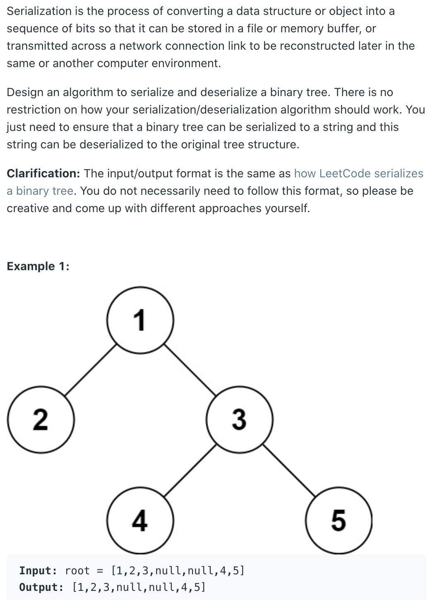
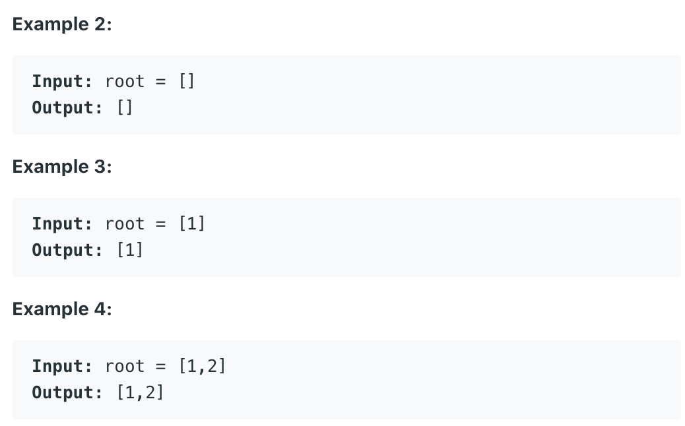

## 297. Serialize and Deserialize Binary Tree



- T = O(n)
- Space = O(n)

```java
/**
 * Definition for a binary tree node.
 * public class TreeNode {
 *     int val;
 *     TreeNode left;
 *     TreeNode right;
 *     TreeNode(int x) { val = x; }
 * }
 */
public class Codec {

    // Encodes a tree to a single string.
    public String serialize(TreeNode root) {
        //corner case
        if (root == null) {
            return "";
        }        
        //BFS-Queue; 
        Queue<TreeNode> queue = new LinkedList<>();
        StringBuilder sb = new StringBuilder();
        queue.offer(root);
        
        while (!queue.isEmpty()) {
            TreeNode cur = queue.poll();
            if (cur == null) {
                sb.append("null");
            } else {
                sb.append(cur.val);
                queue.offer(cur.left);
                queue.offer(cur.right);
            }   
            sb.append(",");
        }
        // sb.deleteCharAt(sb.length() - 1);
        return sb.toString();
    }

    // Decodes your encoded data to tree.
    public TreeNode deserialize(String data) {
        //corner case
        if (data == "") {
            return null;
        }
        //split string by ","
        String[] arr = data.split(",");
        //Queue, not empty
        Queue<TreeNode> queue = new LinkedList<>();
        TreeNode root = new TreeNode(Integer.parseInt(arr[0]));
        queue.offer(root);
        //1.create treenode; 2. connect to parent node 3. add to queue
        for (int i = 1; i < arr.length; i++) {
            TreeNode cur = queue.poll();
            if (!arr[i].equals("null")) {
                TreeNode left = new TreeNode(Integer.parseInt(arr[i]));
                cur.left = left;
                queue.offer(left);
            }
            
            if (!arr[++i].equals("null")) {
                TreeNode right = new TreeNode(Integer.parseInt(arr[i]));
                cur.right = right;
                queue.offer(right);
            }
        }
        return root;
    }
}

// Your Codec object will be instantiated and called as such:
// Codec ser = new Codec();
// Codec deser = new Codec();
// TreeNode ans = deser.deserialize(ser.serialize(root));
```