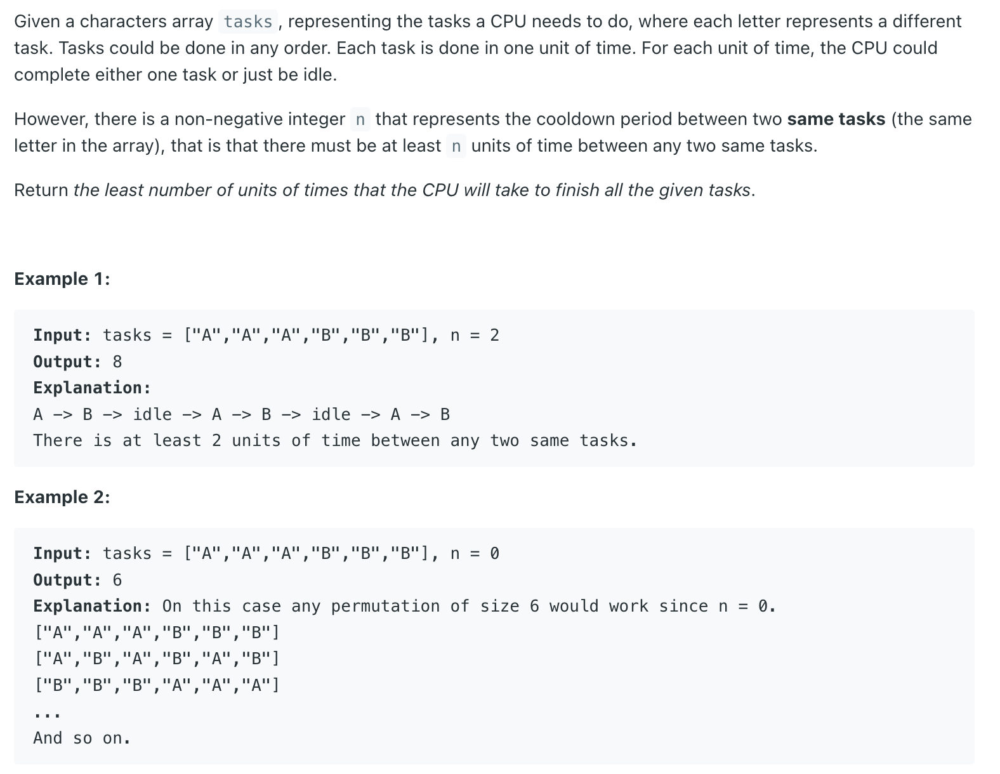
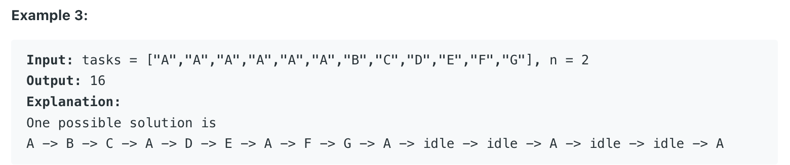
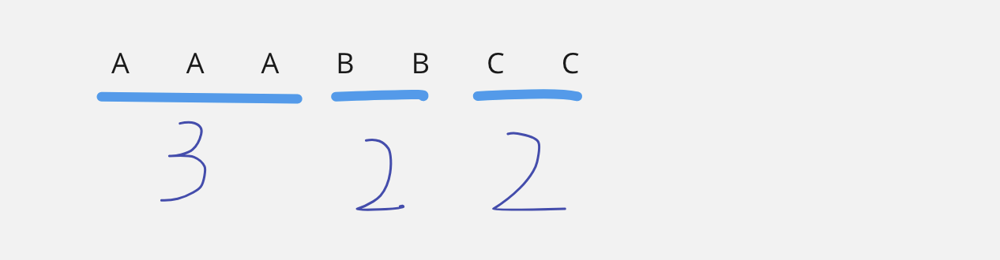
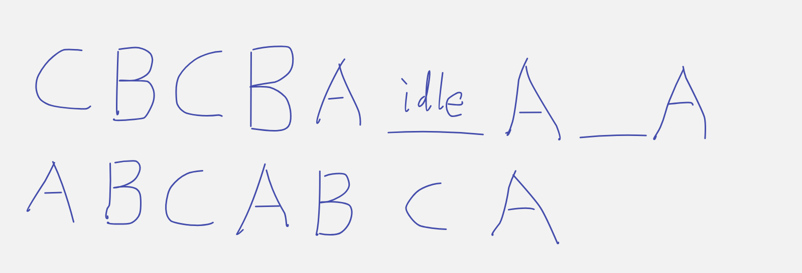
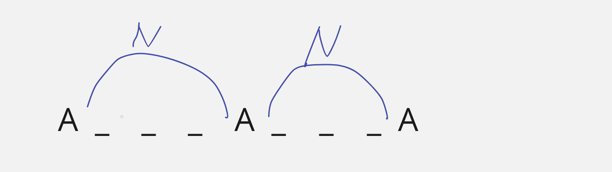
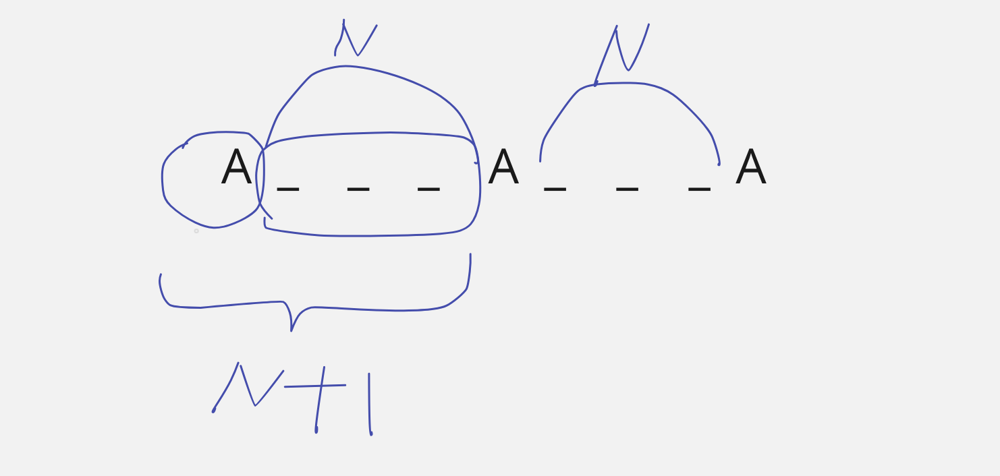
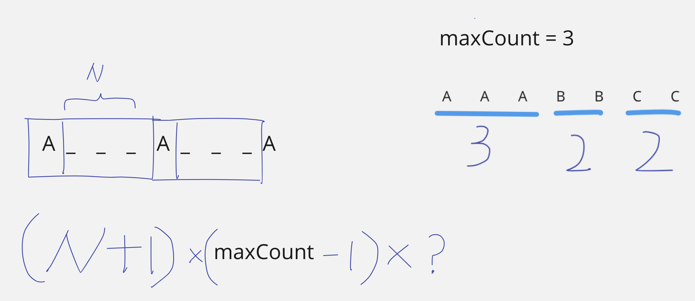
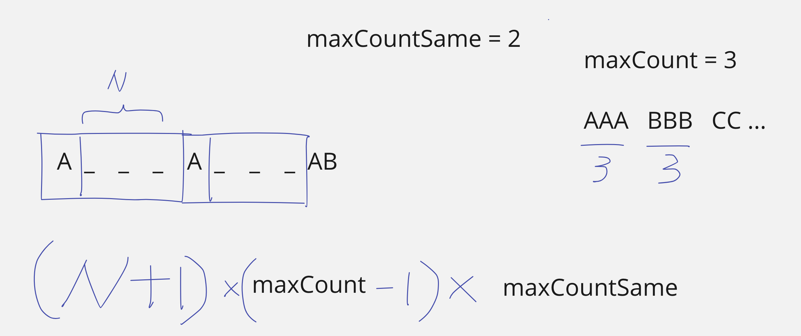
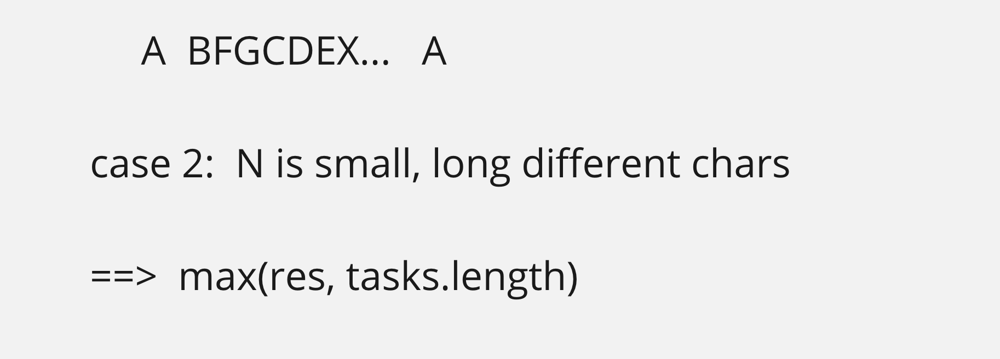

## 621. Task Scheduler


---

-  the cooldown period between two same tasks (the same letter in the array)



- It's better to **process the more frequent character**

- let's say we do `B` first:



- we notice the **second line** is the **minimize the idle time** rather than first one

- since **A** is the most frequent







- but, when we have two **maxCount**, such as `AAA BBB CC ...`





---

```java
class Solution {
    public int leastInterval(char[] tasks, int n) {
        int[] freq = new int[26];
        
        int maxCount = 0;
        int maxCountSame = 0;
        int res = 0;
        for (char task : tasks) {
            freq[task - 'A']++;
        }
        
        for (int num : freq) {
            if (num > maxCount) {
                maxCount = num;
                maxCountSame = 1;
            } else if (num > 0 & num == maxCount) {
                maxCountSame++;
            }
        }
        
        res = (n + 1) * (maxCount - 1) + maxCountSame;
        return Math.max(res, tasks.length);
    }
}

```