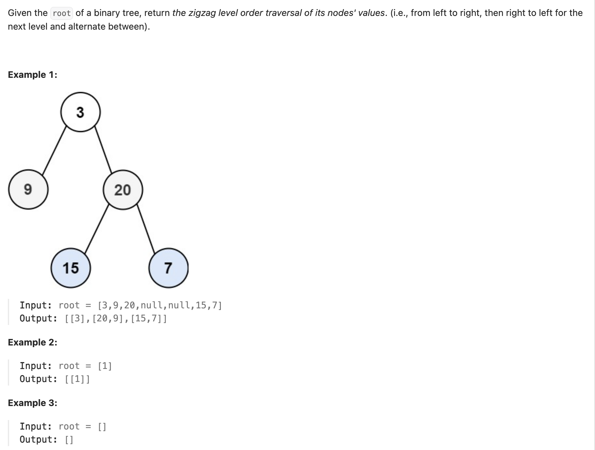
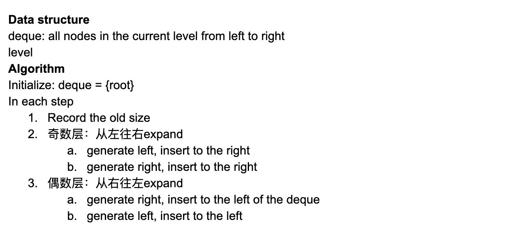

## 103. Binary Tree Zigzag Level Order Traversal


---
```ruby
        1    ---->  odd level
       /  \ 
     2     3  <----  even level
    / \   /  \ 
   4   5  6   7  ----> odd level
  / \        / \ 
  8  9      10 11  <---- even level
```


---

```java
class _103_BinaryTreeZigzagLevelOrderTraversal {
    public List<List<Integer>> zigzagLevelOrder(TreeNode root) {
        if (root == null) {
            return new ArrayList<>();
        }
        boolean reverse = false;
        List<List<Integer>> res = new ArrayList<>();
        Queue<TreeNode> queue = new ArrayDeque<>();
        queue.offer(root);

        while (!queue.isEmpty()) {
            int size = queue.size();
            List<Integer> line = new ArrayList<>();
            for (int i = 0; i < size; i++) {
                TreeNode node = queue.poll();
                line.add(node.val);

                if (node.left != null) {
                    queue.offer(node.left);
                }
                if (node.right != null) {
                    queue.offer(node.right);
                }
            }

            if (reverse) {
                Collections.reverse(line);
            }
            res.add(line);
            reverse = !reverse;
        }
        return res;
    }
}
```
---

```py
class TreeNode:
    def __init__(self, val=0, left=None, right=None):
        self.val = val
        self.left = left
        self.right = right
        
class Solution:
    def zigzagLevelOrder(self, root: Optional[TreeNode]) -> List[List[int]]:
        if not root:
            return []
        res = []
        reverse = False
        q = [root]

        while q:
            size = len(q)
            line = []
            for _ in range(size):
                node = q.pop(0)
                line.append(node.val)
                if node.left:
                    q.append(node.left)
                if node.right:
                    q.append(node.right)

            if reverse:
                res.append(line[::-1])
            else:
                res.append(line)

            reverse = not reverse
        return res
```