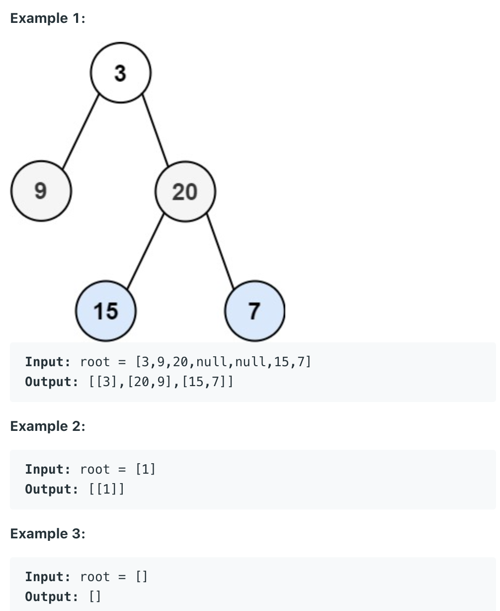

## 103. Binary Tree Zigzag Level Order Traversal

- Given the `root` of a binary tree, return the `zigzag level order traversal` of its 
  nodes' values. (i.e., from left to right, then right to left for the next level and 
  alternate between).



```ruby
        1    ---->  odd level
       /  \ 
     2     3  <----  even level
    / \   /  \ 
   4   5  6   7  ----> odd level
  / \        / \ 
  8  9      10 11  <---- even level
```


```java
/**
 * Definition for a binary tree node.
 * public class TreeNode {
 *     int val;
 *     TreeNode left;
 *     TreeNode right;
 *     TreeNode() {}
 *     TreeNode(int val) { this.val = val; }
 *     TreeNode(int val, TreeNode left, TreeNode right) {
 *         this.val = val;
 *         this.left = left;
 *         this.right = right;
 *     }
 * }
 */
class Solution {
    public List<List<Integer>> zigzagLevelOrder(TreeNode root) {
        List<List<Integer>> res = new ArrayList<>();
        if (root == null) {
            return res;
        }
        Deque<TreeNode> deque = new ArrayDeque<>();
        deque.offer(root);
        int layer = 1; // layer = 0 means even layer
                       // layer = 1 means odd layer
        while(!deque.isEmpty()) {
            int size = deque.size();
            // The size of current level
            List<Integer> temp = new ArrayList<>();
            for (int i = 0; i < size; i++) {                
                if (layer == 0) {
                    //at even layer, from right to left
                    TreeNode cur = deque.pollLast();
                    temp.add(cur.val);
                    if (cur.right != null) {
                        deque.addFirst(cur.right);
                    }
                    if (cur.left != null) {
                        deque.addFirst(cur.left);
                    }                    
                } else {
                    //at odd layer, from left to right
                    TreeNode cur = deque.pollFirst();
                    temp.add(cur.val);
                    if (cur.left != null) {
                        deque.addLast(cur.left);
                    }
                    if (cur.right != null) {
                        deque.addLast(cur.right);
                    }                      
                }
            }
            res.add(temp);
            layer = 1 - layer;
        }
        return res;
    }
}
```
