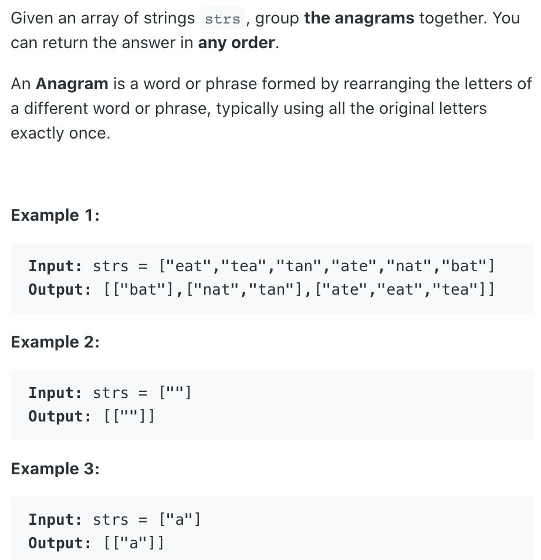
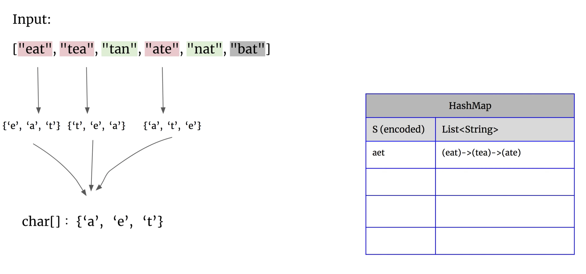
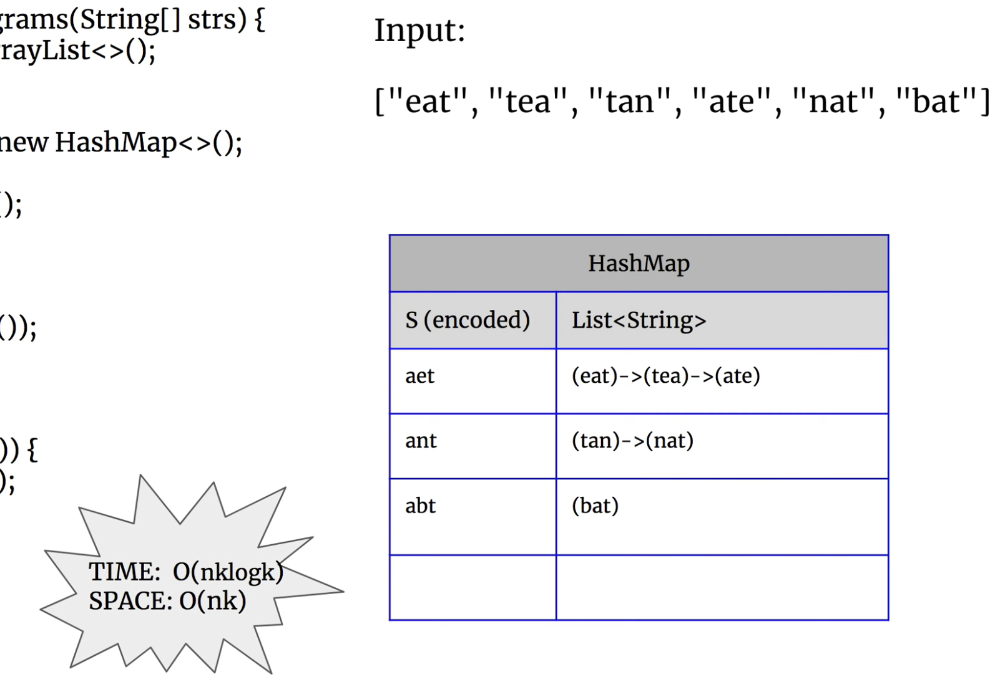

## 49. Group Anagrams

---

### analysis




---

```java
class Solution {
    public List<List<String>> groupAnagrams(String[] strs) {
        List<List<String>> res = new ArrayList<>();
        if (strs == null || strs.length == 0) {
            return res;
        }
        
        Map<String, List<String>> map = new HashMap<>();
        for (int i = 0; i < strs.length; i++) {
            char[] tmpkey = strs[i].toCharArray();
            Arrays.sort(tmpkey);
            String key = String.valueOf(tmpkey);
            if (!map.containsKey(key)) {
                map.put(key, new ArrayList<>());
            }
            map.get(key).add(strs[i]);
        }
        
        for (List<String> list : map.values()) {
            res.add(new ArrayList<>(list));
        }
        return res;
    }
}
```
---

```js
/**
 * @param {string[]} strs
 * @return {string[][]}
 */
var groupAnagrams = function(strs) {
    var map = new Map();
    
    for (let str of strs) {
        const key = [...str].sort().join('');
        if (!map.get(key)) {
            map.set(key, []);
        }
        map.get(key).push(str)
    }
    
    return [...map.values()];
};
```