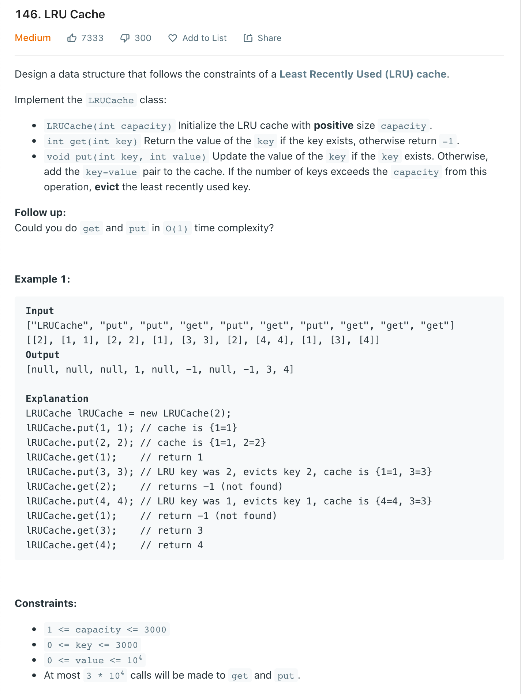
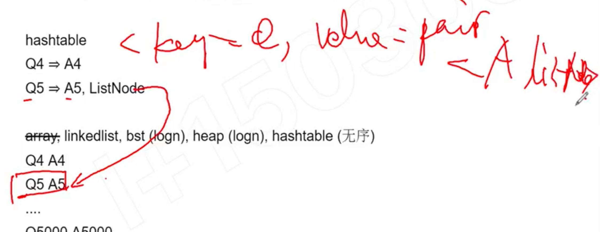
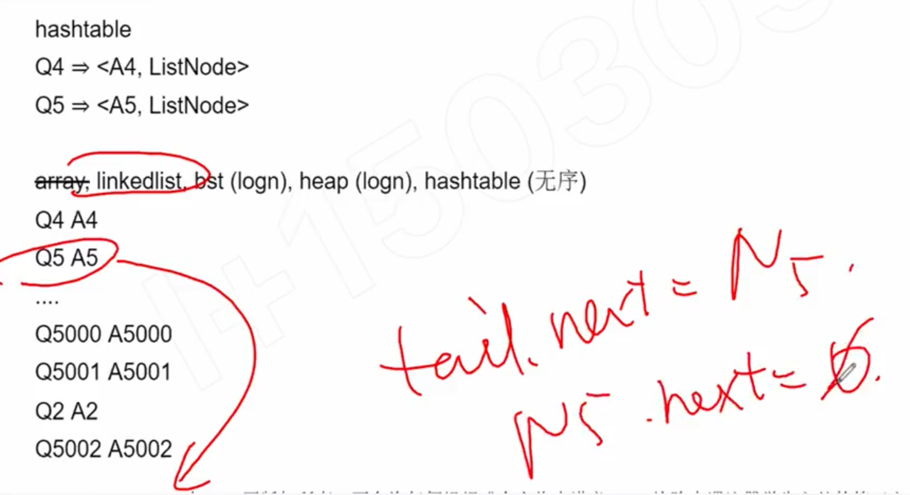
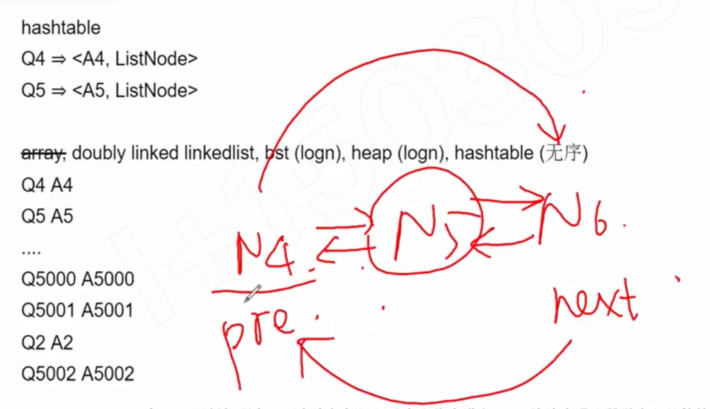

## 146. LRU Cache



---

### from oldest (least recently used) to newest (most recently used)

---

Step1 : 

```ruby
Q1      A1     
Q2      A2      #  如果<Q2  A2>   被访问 => 就放到列表的最后一栏
Q3      A3
...

Q5000   A5000
Q5001   A5001
```


Step 2 :

```ruby
Q1      A1     # 现在把least recently used, 删除

Q3      A3
...

Q5000   A5000
Q5001   A5001
Q2      A2      #  当<Q2  A2> 访问过后 => 现在放到列表的最后一栏
```


Step 3:

```ruby

Q3      A3    # 现在把least recently used, 删除
...

Q5000   A5000
Q5001   A5001
Q2      A2 
Q5002   A5002
```

---

Use case

1. find the answer of an existing question => HashTable
2. insert a <question, answer> pair
3. delete the oldest question
4. move the recently used question to the end of the list


- (array 不行), linkedlist, bst (logN), heap (logN), hashTable (unorder)



- <key -> Q, Value -> Pair>,  Pair<A, listNode>

- HashTable:
  Q4 => <A4, ListNode>
  Q5 => <A5, ListNode>



- 但是现在，有一个问题， `<Q4 A4> => <Q5, A5>`, 

---

- 所以到这里我们需要一个 double linkedlist



---

```java
public class LRUCache {
    static class Node {
        Node next;
        Node previous;
        int key;
        int value;

        //current node hold key and val
        Node(int key, int val) {
            this.key = key;
            this.value = val;
        }

        // update my node's value
        void update(int key, int value) {
            this.key = key;
            this.value = value;
        }
    }

    private final int capacity;
    //HashMap contain such every a element that contains: 
    //<key, Node>, Node => <key, value>
    protected HashMap<Integer, Node> map;

    // maintain all the time that the head and tail of 
    //current doubly LinkedList
    private Node head;
    private Node tail;

    public LRUCache(int capacity) {
        this.capacity = capacity;
        map = new HashMap<>();
    }

    public int get(int key) {
        Node node = map.get(key);
        if (node == null) {
            return -1;
        }
        //Even though we just read from linkedList, 
        //but we still need to move node to the head
        remove(node);
        appendToHead(node);
        return node.value;
    }

    public void put(int key, int value) {
        Node node = null;
        //1. if the key already in the cache, 
        //we need to update its value
        //and move it to head (most recently used position)
        if (map.containsKey(key)) {
            node = map.get(key);
            node.value = value;
            remove(node);
            appendToHead(node);
        } else if (map.size() < capacity) {
            //2. if the key is not in the cache, 
            //assume we have enough space
            // we just need to add new node into the head
            node = new Node(key, value);
            appendToHead(node);
        } else {
            //3. if the key is not in the cache, 
            // even we don't have enough space
            // we need to evict the tail
            // move the new node<key, value> into the head
            node = tail;
            remove(node);
            node.update(key, value);
            appendToHead(node);
        }
    }

    private void appendToHead(Node node) {
        map.put(node.key, node);
        if (head == null) {
            head = tail = node;
        } else {
            node.next = head;
            head.previous = node;
            head = node;
        }
    }

    /**
     * there are 4 cases for doubly linkedList 
     * to maintain its order
     * @param node the current node that 
     *  we need to remove from double LinkedList
     */
    private void remove(Node node) {
        map.remove(node.key);
        if (node.previous != null) {
            node.previous.next = node.next;
        }
        if (node.next != null) {
            node.next.previous = node.previous;
        }
        if (node == head) {
            head = head.next;
        }
        if (node == tail) {
            tail = tail.previous;
        }
        node.previous = null;
        node.next = null;
    }

    public static void main(String[] args) {
        LRUCache lRUCache = new LRUCache(5);
        lRUCache.put(1, 1);
        lRUCache.put(2, 2);
        int temp = lRUCache.get(1);
        System.out.println("Should return 1 => " + temp);  
        // return 1
        lRUCache.put(3, 3);
        lRUCache.put(4, 4);
        lRUCache.put(5, 5);
        lRUCache.put(6, 6); 
        // evicts key 2, cache is {1=1, 3=3, 4=4, 5=5, 6=6}

        lRUCache.map.forEach(
            (key, node) -> System.out.println(key + " => " + node.value)
        );

        temp = lRUCache.get(2);
        System.out.println("Should return -1 => " + temp);

        lRUCache.put(7, 7); 
        // evicts key 1, cache is {3=3, 4=4, 5=5, 6=6, 7=7}
        lRUCache.map.forEach(
            (key, node) -> System.out.println(key + " => " + node.value)
        );

        temp = lRUCache.get(3);
        System.out.println("Should return 3 => " + temp);  // return 3
        temp = lRUCache.get(4);
        System.out.println("Should return 4 => " + temp);  // return 4
    }
}
```

---


### Method2 Using LinkedHashMap

```java
class LRUCache {

    int capacity;
    LinkedHashMap<Integer, Integer> map =  
                            new LinkedHashMap<Integer, Integer>();

    public LRUCache(int capacity) {
        this.capacity = capacity;
    }

    /**
     * @param key
     * @return
     */
    public int get(int key) {
        if(map.containsKey(key)){
            int val = map.get(key);
            map.remove(key);
            map.put(key, val);
            return val;
        }else{
            return -1;
        }
    }

    /**
     * @param key
     * @param value
     */
    public void put(int key, int value) {
        if(map.containsKey(key)){
            map.remove(key);
            map.put(key,value);
            return;
        }
        
        if(map.size() >= capacity){
            map.remove(map.keySet().iterator().next());
        }
        map.put(key,value);
    }
}

```
