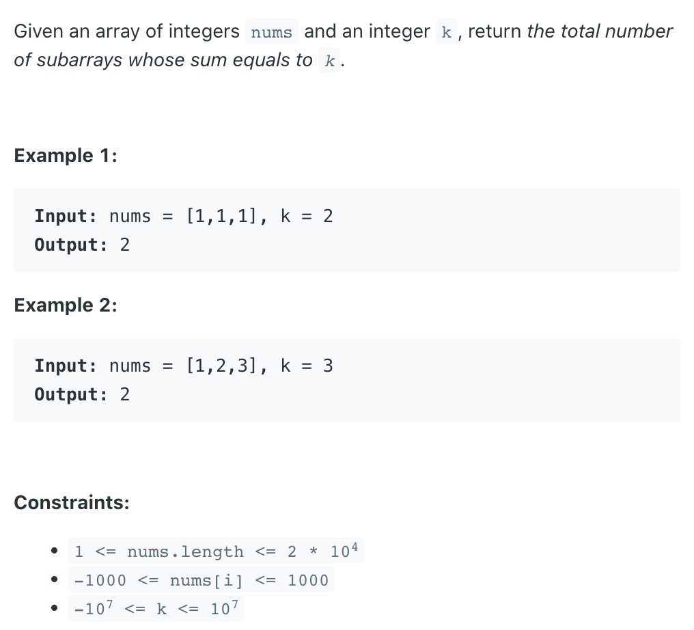

## 560. Subarray Sum Equals K


- Solution 1. **Brute force**. We just need two loops (i, j) and test if 
  `SUM[i, j] = k`. Time complexity O(n^2), Space complexity O(1). 
  I bet this solution will TLE.

- Solution 2. From solution 1, we know the key to solve this problem is `SUM[i, j]`. 
  So if we know `SUM[0, i - 1]` and `SUM[0, j]`, then we can easily get SUM[i, j]. To 
  achieve this, we just need to go through the array, calculate the current sum and 
  save number of all seen `PreSum` to a HashMap. Time complexity O(n), Space 
  complexity O(n).

---

- n computer science, the prefix sum, cumulative sum, inclusive scan, or simply scan 
  of a sequence of numbers x0, x1, x2, ... is a second sequence of numbers y0, y1, 
  y2, ..., the sums of prefixes (running totals) of the input sequence:

- Examples:

```ruby
Input  : arr[] =       {10, 20, 10,  5, 15}
Output : prefixSum[] = {10, 30, 40, 45, 60}

Explanation : While traversing the array, update 
the element by adding it with its previous element.
prefixSum[0] = 10, 
prefixSum[1] = prefixSum[0] + arr[1] = 30, 
prefixSum[2] = prefixSum[1] + arr[2] = 40 and so on.
```
---

- Set the first element of the array "sum" to 0, and initialize the array "sum" 
  **from index 1 rather than 0**.
```ruby
nums = [1,   2,   3  ]
sum  = [0,   1,   1+2, 1+2+3] 
// Also, the length of "sum" is one more than "nums"  

sum[i] = sum[i - 1] + nums[i - 1]
```
- Using array "sum" to calculate the sum of a subarray
  - `sumOfSubarray = sum[end] - sum[start];`

- For Examples:
  - Caculate the sum of "nums" means using 
    the last element of "sum" minus the first element of "sum" which is 0 :
    `nums[0] + nums[1] + nums[2] = sum[3] - sum[0] = 6 - 0`

- **Brute Force**:

```java
public class Solution {
    public int subarraySum(int[] nums, int k) {
        int count = 0;
      
        int[] sum = new int[nums.length + 1];
        sum[0] = 0;
        for (int i = 1; i <= nums.length; i++)
            sum[i] = sum[i - 1] + nums[i - 1];
      
        for (int start = 0; start < sum.length; start++) {
            for (int end = start + 1; end < sum.length; end++) {
                if (sum[end] - sum[start] == k)
                    count++;
            }
        }
        return count;
    }
}
```

- Complexity Analysis
  - Time complexity : `O(n2)`
  - Space complexity : `O(n)`
---

- Optimization by Hashmap
- Thinkings:
  - our target is: `current sum - previous sum = k`
  - so `current sum - k = previous sum` (which is stored in the map)
  - `sum - k` means the array elements in between add up to **k**

```java
class Solution {
    public int subarraySum(int[] nums, int k) {
        int[] curSum = new int[nums.length+1];
        // compute prefix sum array
        for(int i = 1; i<= nums.length; i++)
        {
            curSum[i] = curSum[i - 1] + nums[i - 1];
        }
        
        //now the problem becomes find two items from this sums array 
        // so that sums[j]-sums[i] = k (similar to two sum)
        int count = 0; 
        Map<Integer, Integer> map = new HashMap<>();
        for (int i = 0; i < curSum.length; i++)
        {
            //make sure to check sumes[i] here, not target
            if(map.containsKey(curSum[i] - k)) {
                count += map.get(curSum[i] - k);
            }

            if (!map.containsKey(curSum[i])) {
                map.put(curSum[i], 1);
            } else {
                map.put(curSum[i], map.get(curSum[i]) + 1);
            }
        }
        return count;        
    }
}
```


  - Attention : In the previous method, we set the first element of sum to 0. 
    Similarly, we put it in the hashmap, which is (0, 1).


```java
class Solution {
    public int subarraySum(int[] nums, int k) {
        Map<Integer, Integer> preSum = new HashMap<>();
        preSum.put(0, 1);//key: preSum, value: frequency
        int count = 0;
        int curSum = 0;
        for (int i = 0; i < nums.length; i++) {
            curSum += nums[i];
            if (preSum.containsKey(curSum - k)) {
                count += preSum.get(curSum - k);                
            }
            // it means there is some sum value v between 0 and x, 
            // which makes sum of array [x + 1 to i] == k
            // the frequency is the number of x
            preSum.put(curSum, preSum.getOrDefault(curSum, 0) + 1);
        }
        return count;
    }
}
```