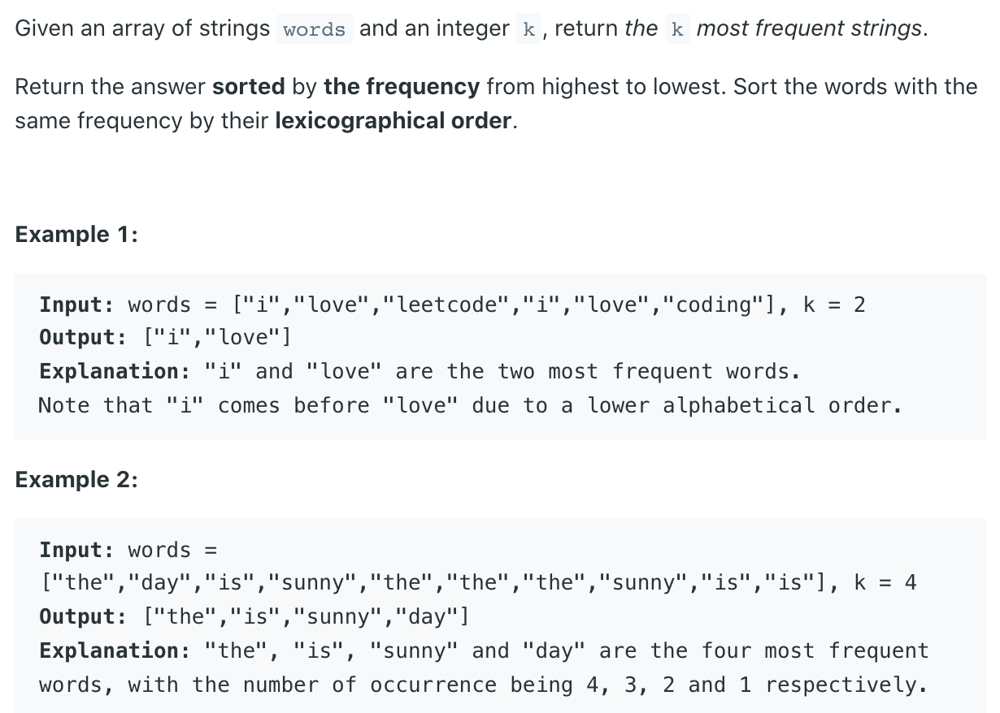

## 692. Top K Frequent Words


---


## extra reading

- [Comparator Interface Type](https://novemberfall.github.io/LeetCode-NoteBook/#/oritented/comparator)

- `Interface Map.Entry<K,V>`, 

---

## Analysis:


- if you are not familiar with the implementation of Comparator, use lambda
- step1: convert stirng array to HashMap with entry<String, Integer>, 词汇作为key, 频率作为value
- 当词汇出现第一次， `HashMap.put(string, 1)`
- 当词汇出现第二次， `HashMap.put(string, val+1)`
 
- 本题关键点： `Comparator` 的实现
  - ` if(e1.getValue() == e2.getValue())` => 对e2.key 和 e1.key 进行比较，注意顺序
  - if 他们之间的值不相等，对val 进行比较


```java
class Solution {
    public List<String> topKFrequent(String[] words, int k) {
        if(words.length == 0){
            return new ArrayList<String>();
        }
        Map<String, Integer> freqMap = getFreqMap(words);
        PriorityQueue<Map.Entry<String,Integer>> minHeap = new PriorityQueue<>(
        new Comparator<Map.Entry<String,Integer>>(){
            @Override
            public int compare(Map.Entry<String,Integer> e1, 
            Map.Entry<String,Integer> e2){
                if(e1.getValue() == e2.getValue()){
                    return e2.getKey().compareTo(e1.getKey());
                }else{
                    return e1.getValue() - e2.getValue();   
                }
            }
        });
        
        // //If using Lambda =>
        // PriorityQueue<Map.Entry<String,Integer>> minHeap = new PriorityQueue<>(
        //     (a, b)->(
        //         (a.getValue() == b.getValue()) ? b.getKey().compareTo(a.getKey()) : a.getValue() - b.getValue();
        //     );
        // );
        
        for(Map.Entry<String,Integer> entry : freqMap.entrySet()){
            minHeap.offer(entry);
            if(minHeap.size() > k){
                minHeap.poll();
            }
        }
        
        List<String> result = new ArrayList<>();
        while(!minHeap.isEmpty()){
            result.add(0, minHeap.poll().getKey());
        }
        return result;
        
    }
    
    //convert string array to HashMap
    private Map<String,Integer> getFreqMap(String[] words){
        Map<String,Integer> freqMap = new HashMap<>();
        for(String s : words){
            Integer val = freqMap.get(s);
            if(val == null){
                freqMap.put(s, 1);
            }else{
                freqMap.put(s, val + 1);
            }
        }
        return freqMap;
    }
}
```

---

```java
class Solution {
    public List<String> topKFrequent(String[] words, int k) {
        List<String> res = new ArrayList<>();
        if (words == null || words.length == 0) {
            return res;
        }
        
        HashMap<String, Integer> freqMap = getFreqMap(words);
        PriorityQueue<Map.Entry<String, Integer>> minHeap = new PriorityQueue<>(k, 
        new Comparator<Map.Entry<String, Integer>>(){
            @Override
            public int compare(Map.Entry<String, Integer> e1, 
            Map.Entry<String, Integer> e2){
                if (e1.getValue() == e2.getValue()) {
                    return e2.getKey().compareTo(e1.getKey());
                } 
                return e1.getValue() < e2.getValue() ? -1 : 1;
            }
        });
        
        
        for (Map.Entry<String, Integer> entry : freqMap.entrySet()) {
            minHeap.offer(entry);
            if (minHeap.size() > k) {
                minHeap.poll();
            }
        }
        
        while (!minHeap.isEmpty()) {
            res.add(0, minHeap.poll().getKey());
        }
        return res;
    }
    
    private HashMap<String, Integer> getFreqMap(String[] words){
        HashMap<String, Integer> map = new HashMap<>();
        for (String cur : words) {
            if (map.containsKey(cur)) {
                map.put(cur, map.get(cur) + 1);
            } else {
                map.put(cur, 1);
            }
        }
        return map;
    }
}
```


