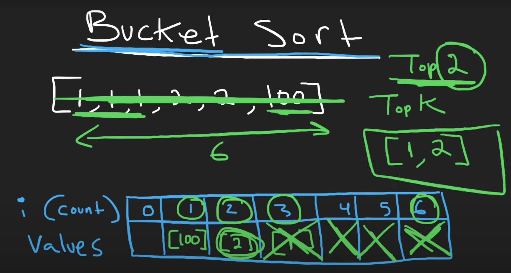

## 347. Top K Frequent Elements

- Given an integer array `nums` and an integer `k`, return the `k` most frequent elements. 
  You may return the answer in **any order**.


```java
class Solution {
    public int[] topKFrequent(int[] nums, int k) {
        if (nums == null || nums.length == 0) {
            return null;
        }
        PriorityQueue<Map.Entry<Integer, Integer>> minHeap = new PriorityQueue<>(k, 
            new Comparator<Map.Entry<Integer, Integer>>(){
                @Override
                public int compare(Map.Entry<Integer, Integer> e1, 
                Map.Entry<Integer, Integer> e2){
                    if (e1.getValue() == e2.getValue()) {
                        return 0;
                    }
                    return e1.getValue() < e2.getValue() ? -1 : 1;
                }                                         
        });
        HashMap<Integer, Integer> freqMap = getFreqMap(nums);
        
        for (Map.Entry<Integer, Integer> entry : freqMap.entrySet()) {
            minHeap.offer(entry);
            if (minHeap.size() > k) {
                minHeap.poll();
            }
        }
        
        int [] res = new int[k];
        for (int i = 0; i < res.length; i++) {
            res[i] = minHeap.poll().getKey();
        }
        return res;
    }
    
    private HashMap<Integer, Integer> getFreqMap(int[] nums){
        HashMap<Integer, Integer> map = new HashMap<>();
        for (Integer cur : nums) {
            Integer val = map.get(cur);
            if (val == null) {
                map.put(cur, 1);
            } else {
                map.put(cur, val + 1);
            }
        }
        return map;
    }
}
```

---

## bucket Sort

```java
class Solution {
    public int[] topKFrequent(int[] nums, int k) {
        Map<Integer, Integer> count = new HashMap<>();
        List<Integer>[] freq = new List[nums.length + 1];
        for (int i = 0; i < freq.length; i++) {
            freq[i] = new ArrayList<>();
        }
        for (int num : nums) {
            count.put(num, count.getOrDefault(num, 0) + 1);
        }


        for (Map.Entry<Integer, Integer> entry : count.entrySet()) {
            int num = entry.getKey();
            int freIndex = entry.getValue(); // frequency ==> Index
            freq[freIndex].add(num);
        }

        List<Integer> res = new ArrayList<>();
        for (int i = freq.length - 1; i >= 0; i--) {
            for (int num : freq[i]) {
                res.add(num);
                if (res.size() == k) {
                    return res.stream().mapToInt(integer -> integer).toArray();
                }
            }
        }
        return new int[]{};
    }
}
```
---

### python



```py
class topKFrequent:
    def topKFrequent(self, nums: List[int], k: int) -> List[int]:
        count = {}
        freq = [[] for i in range(len(nums) + 1)]

        for n in nums:
            count[n] = count.get(n, 0) + 1
        for n, f in count.items():
            freq[f].append(n)

        res = []
        for i in range(len(freq) - 1, 0, -1):
            for n in freq[i]:
                res.append(n)
                if len(res) == k:
                    return res
```