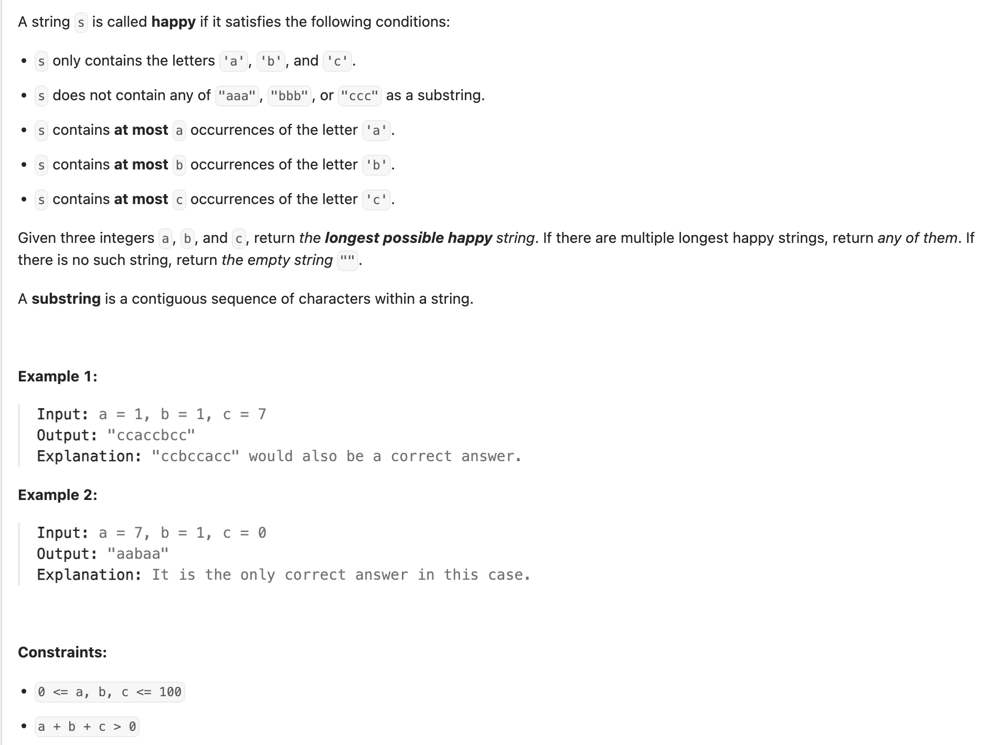

## 1405. Longest Happy String

---

- use a maxHeap to help create a longest string
  - 1. three same chars in a row that is not allowed
  - 2. firstly use most-frequency chars to create but no more than 3
  - 3. if it is going to reachs to 3 chars, use second frequency chars
  - 4. After adding a character, we reduce its count. If it still has characters left, we put it back into the heap.

---

```java
class _1405_Longest_Happy_String {
    class Pair {
        char character;
        int count;
        public Pair(char character, int count) {
            this.character = character;
            this.count = count;
        }
    }
    public String longestDiverseString(int a, int b, int c) {
        PriorityQueue<Pair> maxHeap = new PriorityQueue<>((o1, o2) -> o2.count - o1.count);
        if (a > 0) {
            maxHeap.add(new Pair('a', a));
        }
        if (b > 0) {
            maxHeap.add(new Pair('b', b));
        }
        if (c > 0) {
            maxHeap.add(new Pair('c', c));
        }

        StringBuilder res = new StringBuilder();
        while (!maxHeap.isEmpty()) {
            Pair p = maxHeap.poll();
            int count = p.count;
            char chr = p.character;
            // If three consecutive characters exists, pick the second most frequent character.
            if (res.length() >= 2 && res.charAt(res.length() - 1) == p.character &&
                    res.charAt(res.length() - 2) == p.character) {
                if (maxHeap.isEmpty()) {
                    break;
                }
                Pair secondFreq = maxHeap.poll();
                res.append(secondFreq.character);
                if (secondFreq.count - 1 > 0) {
                    maxHeap.add(new Pair(secondFreq.character, secondFreq.count - 1));
                }
            } else {
                count--;
                res.append(chr);
            }

            // If count is greater than zero, add it to priority queue.
            if (count > 0) {
                maxHeap.add(new Pair(chr, count));
            }
        }
        return res.toString();
    }
}
```
---

```py
class Solution:
    def longestDiverseString(self, a: int, b: int, c: int) -> str:
        maxHeap = []
        if a > 0:
            heapq.heappush(maxHeap, (-a, 'a'))
        if b > 0:
            heapq.heappush(maxHeap, (-b, 'b'))
        if c > 0:
            heapq.heappush(maxHeap, (-c, 'c'))

        res = []
        while maxHeap:
            temp_count, char = heapq.heappop(maxHeap)
            count = -temp_count
            if len(res) >= 2 and res[-1] == char and res[-2] == char:
                if not maxHeap:
                    break
                temp_count2, char2 = heapq.heappop(maxHeap)
                res.append(char2)
                count2 = -temp_count2
                count2 -= 1
                if count2 > 0:
                    heapq.heappush(maxHeap, (-count2, char2))
            else:
                count -= 1
                res.append(char)

            if count > 0:
                heapq.heappush(maxHeap, (-count, char))

        return ''.join(res)
```