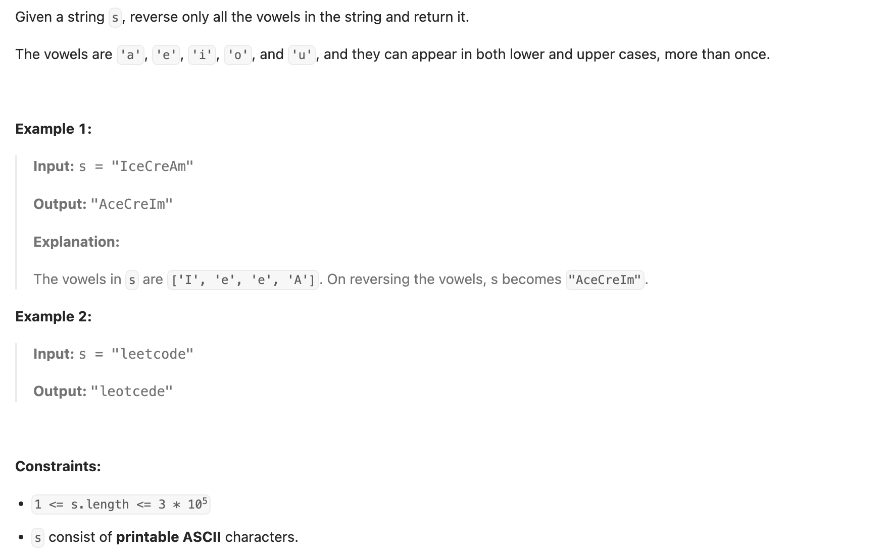

## 345. Reverse Vowels of a String

---

```py
class Solution:
    def reverseVowels(self, s: str) -> str:
        if not s:
            return s
        vowels = set(['a', 'e', 'i', 'o', 'u'])
        array = list(s)
        left, right = 0, len(s) - 1
        while left < right:
            if array[left] not in vowels:
                left += 1
            if array[right] not in vowels:
                right -= 1
            if array[left] in vowels and array[right] in vowels:
                array[left], array[right] = array[right], array[left]
                left += 1
                right -= 1
        return "".join(array)
```