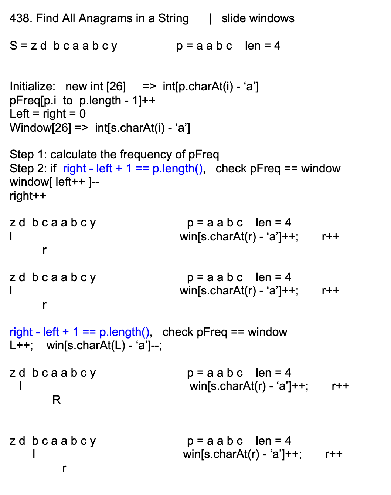

## 438. Find All Anagrams in a String

- Given two strings s and p, return an array of all the start indices of `p's`
  anagrams in s. You may return the answer in any order.

- Example 1:
  Input: s = "cbaebabacd", p = "abc"
  Output: [0,6]
  Explanation:
  The substring with start index = 0 is "cba", which is an anagram of "abc".
  The substring with start index = 6 is "bac", which is an anagram of "abc".

- Example 2:
  Input: s = "abab", p = "ab"
  Output: [0,1,2]
  Explanation:
  The substring with start index = 0 is "ab", which is an anagram of "ab".
  The substring with start index = 1 is "ba", which is an anagram of "ab".
  The substring with start index = 2 is "ab", which is an anagram of "ab".


---




```java
class Solution {
    public List<Integer> findAnagrams(String s, String p) {
        List<Integer> res = new ArrayList<>();
        
        //Record the frequency of occurrence of all letters of p
        int[] pFreq = new int[26];
        for(int i = 0; i < p.length(); i++){
           pFreq[p.charAt(i) - 'a']++; 
        }
        
        //[left right] corresponding to the left and right of window
        int[] window = new int[26];
        int left = 0, right = 0;
        while (right < s.length()) {
            window[s.charAt(right) - 'a']++;
            //increase frequence of letters of window
            if (right - left + 1 == p.length()) {
                //maintain the length of sh, update the result
                if (Arrays.equals(window, pFreq)) {
                    res.add(left);
                }
                window[s.charAt(left) - 'a']--;
                left++;
            }
            right++;
        }
        return res;
    }
}
```

---

```ruby
string s2 = "aabc"      reference_hashmap: <a, 2> <b, 1> <c, 1>
       s1 = "zzzzcdebcaabcyywwwww"
              ----

left = 1
right = 5 
hashmap = {z:3, c:1}
num_matches = 0

如果c 的frequency从对上变成对不上
    num_matches--;
如果c 的frequency从对不上变成对上
    num_matches++;   
    

如果z 的frequency从对上变成对不上
    num_matches--;
如果z 的frequency从对不上变成对上
    num_matches++;   


Data structure:
left
right
hashmap: the frequence of each letter between a[left] and a[right]

Initialize:
left = 0
right = s2.length - 1
hashmap = the frequence of each letter in a[0... s2.length-1]
num_matches = 有多少字母在hashmap中的frequency 和 在reference_hashmap中的 frequence 一致


For each step:
Compare hashmap with reference_hashmap    - O(s2.length)
hashmap[a[left]]--;
left++
right++
hashmap[a[right]]++;
```

