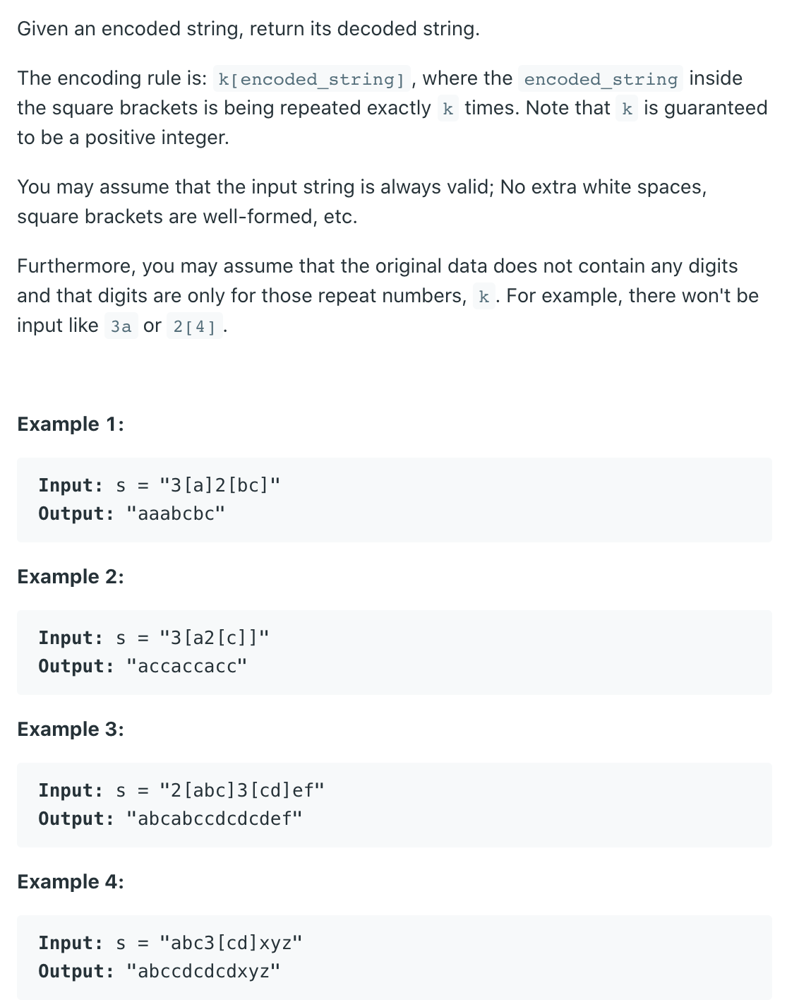
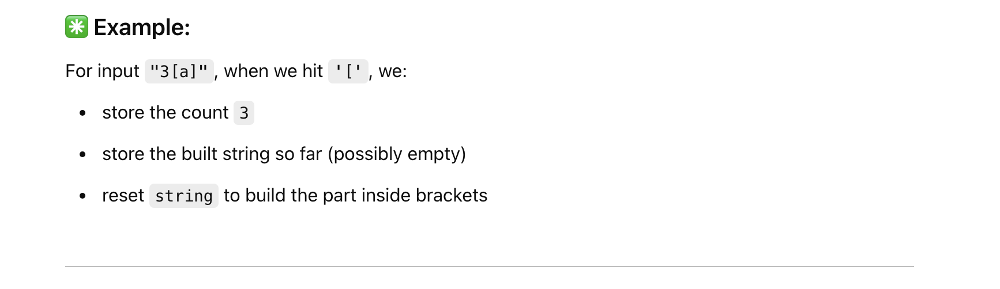
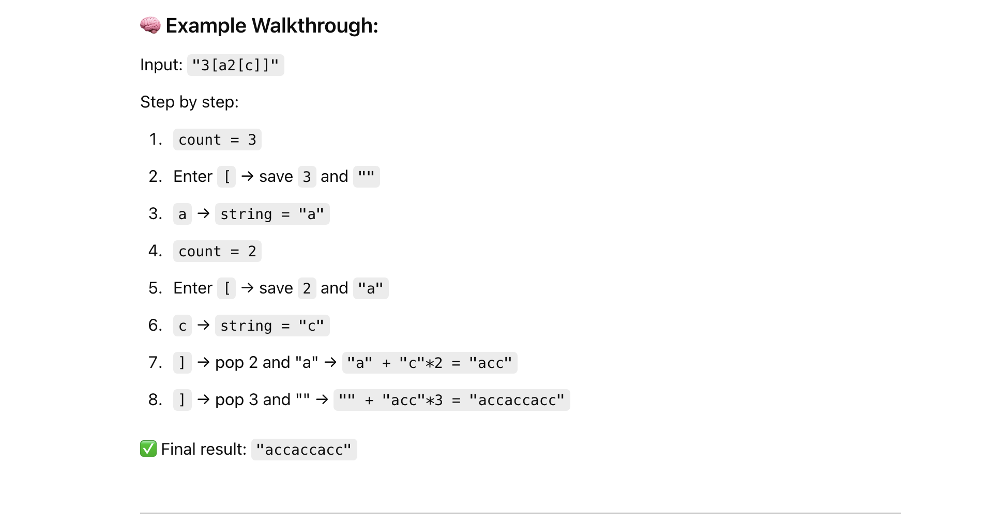

## 394. Decode String



---

- Note： before you see `[`, there must be a number!
  - for example: `3 [ a 2 [ c ] ]`


---


#### Python

```py
class Solution:
    def decodeString(self, s: str) -> str:
        res_stk = []
        cnt_stk = []
        string = ""
        i = 0
        while i < len(s):
            if s[i].isdigit():
                count = 0
                while s[i].isdigit():
                    count = count * 10 + int(s[i]) # build multi-digit numbers
                    i += 1
            elif s[i].isalpha():
                string += s[i]
                i += 1
            elif s[i] == '[':
                cnt_stk.append(count)       # push the repeat count
                res_stk.append(string)      # save the current built string
                string = ""                 # reset for the new group
                i += 1
            else:
                count = cnt_stk.pop()       # get repeat count
                last_res = res_stk.pop()    # get last string
                string = last_res + string * count
                i += 1
        return string
```
---

- `res_stk = []`   # Stack to store previous result strings
- `cnt_stk = []`   # Stack to store repeat counts
- `string = ""`    # The current string being built
- `i = 0`          # Index to traverse input string







---

```java
class Solution {
    public String decodeString(String s) {
        Stack<String> strStack = new Stack<>();
        Stack<Integer> countStack = new Stack<>();
        StringBuilder currentStr = new StringBuilder();
        int i = 0;

        while (i < s.length()) {
            char ch = s.charAt(i);

            // Step 1: If it's a digit, parse the full number
            if (Character.isDigit(ch)) {
                int count = 0;
                while (Character.isDigit(s.charAt(i))) {
                    count = count * 10 + (s.charAt(i) - '0');
                    i++;
                }
                countStack.push(count);
            }

            // Step 2: If it's a letter, add to current string
            else if (Character.isLetter(ch)) {
                currentStr.append(ch);
                i++;
            }

            // Step 3: If it's '[', save the current context
            else if (ch == '[') {
                strStack.push(currentStr.toString());
                currentStr = new StringBuilder();
                i++;
            }

            // Step 4: If it's ']', decode and combine
            else if (ch == ']') {
                int repeatTimes = countStack.pop();
                String prevStr = strStack.pop();
                StringBuilder repeated = new StringBuilder();
                for (int j = 0; j < repeatTimes; j++) {
                    repeated.append(currentStr);
                }
                currentStr = new StringBuilder(prevStr + repeated);
                i++;
            }
        }

        return currentStr.toString();
    }
}

```