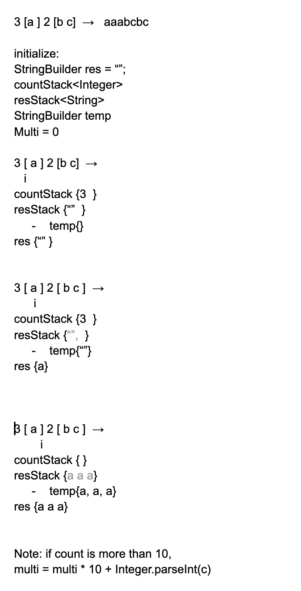

## 394. Decode String



```java
class Solution {
    public String decodeString(String s) {
        if (s == null || s.length() == 0) return null;
        
        Stack<String> stack = new Stack<>();
        int num = 0;
        for (int i = 0; i < s.length(); i++) {
            char c = s.charAt(i);
            if (c >= '0' && c <= '9') {
                num = num * 10 + c - '0';
            } else if (c == '[') {
                stack.push(num + "");
                stack.push("[");
                num = 0;
            } else if (c == ']') {
                String res = "";
                while (stack.peek() != "[") {
                    res = stack.pop() + res;
                }
                stack.pop(); // pop "["
                StringBuilder sb = new StringBuilder();
                int repeats = Integer.valueOf(stack.pop());
                for (int j = 0; j < repeats; j++) {
                    sb.append(res);
                }
                stack.push(sb.toString());
            } else {
                stack.push(c + "");
            }
        }
        
        String ans = "";
        while (!stack.isEmpty()) {
            ans = stack.pop() + ans;
        }
        return ans;
    }
}
```