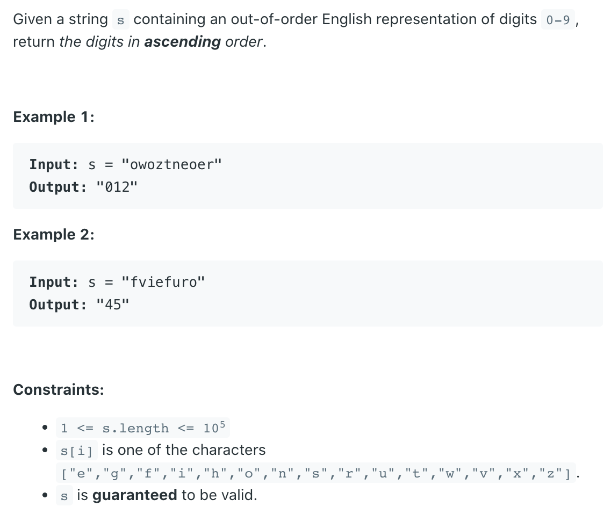

## 423. Reconstruct Original Digits from English


- The even digits all have a unique letter while the odd digits all don't:
  - `zero`: Only digit with `z`
  - `two`: Only digit with `w`
  - `four`: Only digit with `u`
  - `six`: Only digit with `x`
  - `eight`: Only digit with `g`

---

- "zero", "two", "four", "six", "eight", "one", "three", "five", "seven", "nine"

- First count the numbers that has special character.
- Then compute numbers has common characters with those numbers.

```java
public String originalDigits(String s) {
  char[] sc = s.toCharArray();
  int[] count = new int[10];
  for(char c: sc){
    switch(c){
      case 'z': count[0]++; break; // zero
      case 'w': count[2]++; break; // two
      case 'u': count[4]++; break; // four
      case 'x': count[6]++; break; // six
      case 'g': count[8]++; break; // eight
      case 's': count[7]++; break; // = (six, seven) 
      case 'f': count[5]++; break; // = (four, five)
      case 'o': count[1]++; break; // = (zero, one, two, four)
      case 't': count[3]++; break; // = (two, three, eight)
      case 'i': count[9]++; break; // = (five, six, eight, nine) 
    }
  } 
  count[7] = count[7] - count[6];
  count[5] = count[5] - count[4];
  count[1] = count[1] - count[0] - count[2] - count[4];
  count[3] = count[3] - count[2] - count[8];
  count[9] = count[9] - count[5] - count[6] - count[8];
  
  StringBuilder sb = new StringBuilder();
  for(int i = 0; i < 10; i++){
    for(int j = 0; j < count[i]; j++){
      sb.append(i);
    }
  }       
  return sb.toString();
}
```
