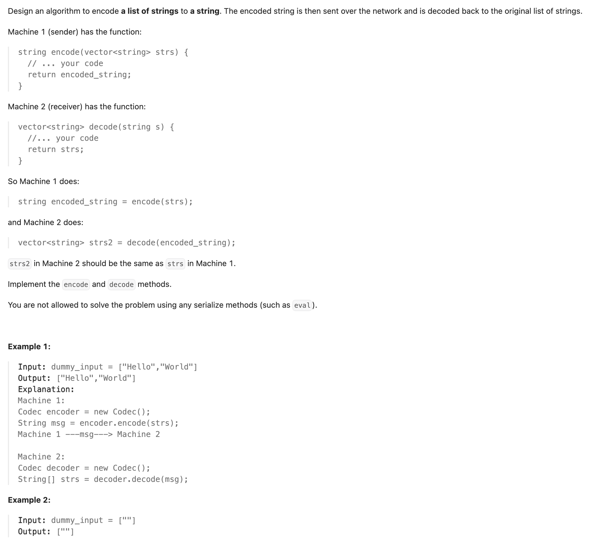
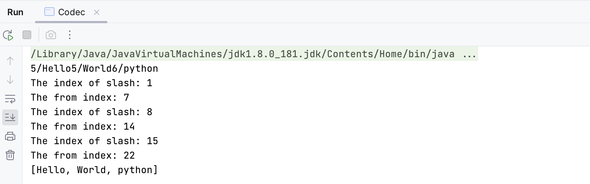

## 271. Encode and Decode Strings

---

```java
class Codec {
    // Encodes a list of strings to a single string.
    public String encode(List<String> strs) {
        StringBuilder sb = new StringBuilder();
        for (String str : strs) {
            sb.append(str.length()).append('/').append(str);
        }
        return sb.toString();
    }

    // Decodes a single string to a list of strings.
    public List<String> decode(String s) {
        List<String> res = new ArrayList<>();
        int fromIndex = 0;
        while (fromIndex < s.length()) {
            int slashIdx = s.indexOf('/', fromIndex);
            System.out.println("The index of slash: " + slashIdx);
            int size = Integer.valueOf(s.substring(fromIndex, slashIdx));
            fromIndex = slashIdx + size + 1;
            System.out.println("The from index: " + fromIndex);
            res.add(s.substring(slashIdx + 1, fromIndex));
        }
        return res;
    }

    public static void main(String[] args) {
        List<String> strs = Arrays.asList("Hello", "World", "python");
        Codec codec = new Codec();
        String encode = codec.encode(strs);
        System.out.println(encode);

        List<String> decode = codec.decode(encode);
        System.out.println(decode);
    }
}
// Your Codec object will be instantiated and called as such:
// Codec codec = new Codec();
// codec.decode(codec.encode(strs));
```

