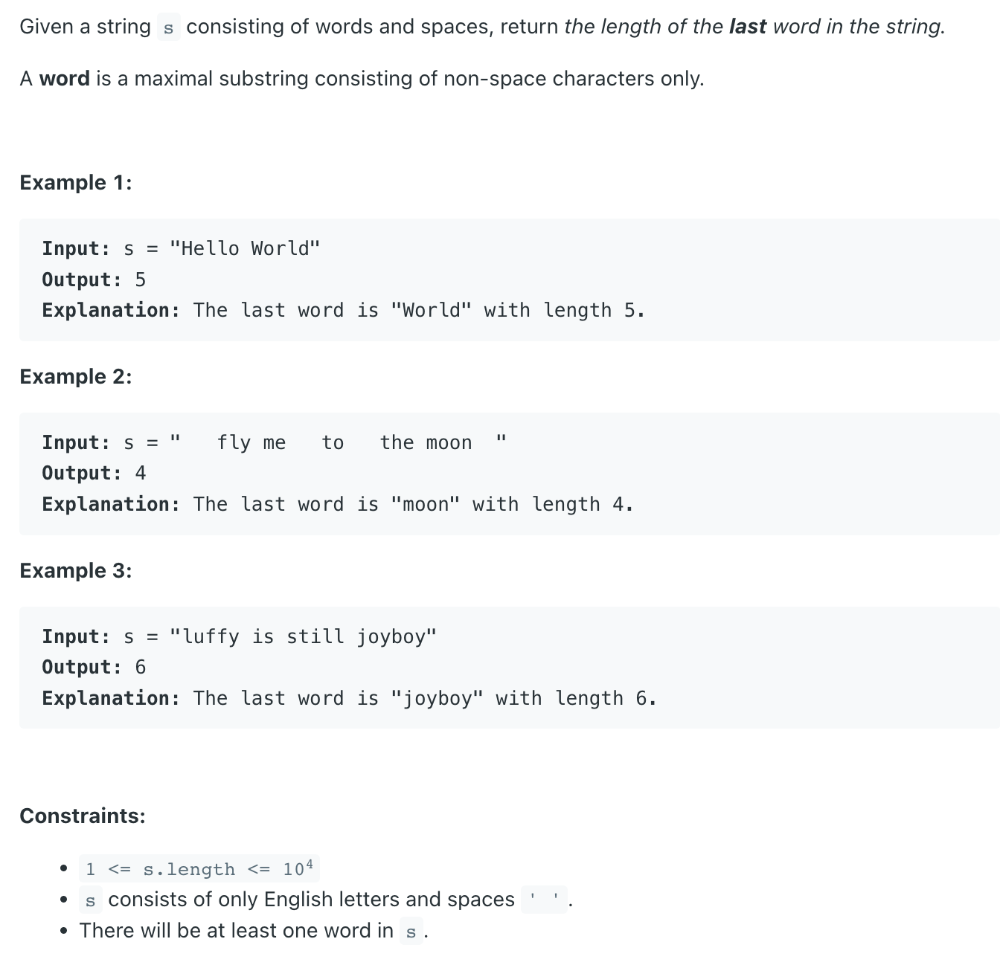

## 58. Length of Last Word


---

### end index

```java
class Solution {
    public int lengthOfLastWord(String s) {
        if (s == null || s.length() == 0) return 0;

        int count = 0, end = s.length() - 1;
        while (end >= 0 && s.charAt(end) == ' ') {
            // Skip all whitespaces at the end of s.
            end--;
        }
        while (end >= 0 && s.charAt(end) != ' ') {
            end--;
            count++;
        }
        return count;
    }
}
```
---

### split method

```java
class lengthOfLastWord_split {
    public int lengthOfLastWord(String s) {
        String[] words = s.split(" ");
        int n = words.length;
        return words[n - 1].length();
    }

    public static void main(String[] args) {
        lengthOfLastWord_split lolw = new lengthOfLastWord_split();
        System.out.println(lolw.lengthOfLastWord("   fly me   to   the moon  "));
    }
}
```